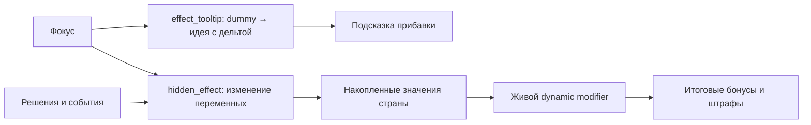

# Фокусы, dynamic modifiers и dummy ideas

## Промышленный цикл Кефрейта

`VAL_refresh_industrial_economy` отображает промышленность одним из трёх
динамических модификаторов: контрактная промышленность, экономический крах,
экономическое чудо. Вложения в выпуск и строительство хранятся отдельно от
`VAL_economic_recovery_steps`, поэтому начало кризиса сохраняет вложения, но
не засчитывает их как выполненные антикризисные программы.

Гражданская война Воркерланда через `VAL_handle_vorkerland_war_outbreak`
однократно устанавливает ступень 0. Начальные штрафы: выпуск -75%,
строительство и рост эффективности -57%, торговый доход -85%, доход военной
промышленности -57%, доля товаров народного потребления +18%.
Каждая из шести программ меняет эти значения соответственно на +13, +10,
+10, +15, +10 и -3 процентных пункта. На ступени 6 базовый результат:
+3%, +3%, +3%, +5%, +3% и 0%; к нему добавляются сохранённые вложения.
Уровневые реформы администрации, промышленности и армии действуют отдельно.

Программы: «Разрыв воркерландских поставок», «Инвентаризация промышленности»,
«Программа станкостроения», «Расширение серийного производства»,
«Система стратегических запасов» и «Новая промышленная политика»
(`VAL_Industrial_Mobilization_Plan`). Мастерские и учёт резервов требуют
инвентаризации после кризиса; финал требует обе линии и допускает обе
взаимоисключающие промышленные стратегии. Каждая программа имеет `cost = 5`.
Фокусы дерева VAL не создают готовые заводы.

Пересчёт вызывается при вложении, начале кризиса и завершении программы и
инвалидирует экономический кеш. Недельный обработчик только однократно
восстанавливает отсутствующую ступень уже начавшегося кризиса по завершённым
фокусам. Отложенный `val_rework.101` не отменяет штраф и не сбрасывает прогресс.
Потеря вестерхольмского металла остаётся отдельным ресурсным последствием:
`VAL_New_Supply_Base` снимает его, но не заменяет промышленные программы.

Country variables хранят накопленные показатели страны, dynamic modifier применяет их, а dummy ideas показывают прибавку конкретного фокуса через `effect_tooltip`. Отдельная идея для каждой ступени не требуется.

Руководство описывает системы Стеландера, передачу подготовки при расколе, ограничения интерфейса и проверки наград. Разбор исходников TFR и их инвентаризация приведены отдельно; он описывает структуру исходного кода, а не результаты игры.

## Ручная смена законов и министров

Общие условия `ADISCORD_manual_law_change_allowed` и `ADISCORD_manual_minister_change_allowed` подключаются к выбранным определениям идей. Без одноимённого country flag условие запрещает ручную смену; `set_country_flag` разрешает её, `clr_country_flag` снова запрещает. Само объявление триггеров ничего не блокирует. Для ограничения всех законов или всего кабинета подключите соответствующее условие ко всем определениям нужных слотов, включая альтернативных кандидатов.

В определении министра используйте оба ограничения, сохраняя существующие условия внутри этих блоков:

```text
available = {
    ADISCORD_manual_minister_change_allowed = yes
}
allowed_to_remove = {
    ADISCORD_manual_minister_change_allowed = yes
}
```

Для закона используйте `ADISCORD_manual_law_change_allowed = yes`. `available` ограничивает ручное назначение, `allowed_to_remove` - снятие и замену уже установленной идеи. Не переносите запрет в `allowed` или `visible`: это условия допуска страны и отображения. Сюжетные `add_ideas`, `remove_ideas` и `swap_ideas` сохраняются в существующих фокусах и событиях; триггеры не добавляют периодических обработчиков.

Если отдельный закон или министр должен освобождаться по собственной сюжетной развилке, оберните общее условие и его страновое условие в `OR`. Страновой триггер храните в файле соответствующей страны. Общий разрешающий флаг открывает все определения, использующие данный общий триггер, поэтому для выборочной разблокировки его устанавливать нельзя.

При подключении проверьте в свежей кампании назначение в пустой слот, замену занятого слота, снятие министра, подсказку запрета и сюжетную смену. Затем проверьте снятие ограничения и переход игрока к стране-преемнику: country flag не следует считать автоматически перенесённым.

Шесть министров стартового партийного кабинета STP используют `STP_party_minister_change_allowed` в `available` и `allowed_to_remove`. На маршруте Шабрата ограничение действует до `STP_cw_started`; завершение выборов само по себе его не снимает. На партийном маршруте и у страны-преемника запрет не действует. Общий флаг `ADISCORD_manual_minister_change_allowed` позволяет явно разрешить ручную смену через сюжетный эффект; отдельный флаг блокировки и периодический обработчик не нужны.

## Размещение страновых данных

Национальные духи и dummy ideas одной страны хранятся вместе: STP - в `common/ideas/ADISCORD_STP_civil_war_ideas.txt`, VAL - в `common/ideas/ADISCORD_VAL_rework_ideas.txt`, Воркерленд - в `common/ideas/ADISCORD_vorkerland_ideas.txt`. Стартовые духи находятся в разделе `starting_ideas`. Категории движка сохраняются: советник Стеландера относится к `political_advisor_head_of_state`, скрытые идеи VAL - к `hidden_ideas`; их нельзя переносить внутрь `country`.

Ливоннское урегулирование занимает разделы `livonn_settlement_*` в основных файлах VAL: `ADISCORD_VAL_effects.txt`, `ADISCORD_VAL_decisions.txt`, `ADISCORD_VAL_rework_categories.txt` и `ADISCORD_VAL_decisions_l_russian.yml`. Его раздел `livonn` находится в `09_ADISCORD_scripted_peace_on_actions.txt` после военного урегулирования STP/SRP. Ограниченная недельная проверка завершения договора сохраняется.

Открытие Грязной зоны использует разделы `dirty_zone_events`, `dirty_zone_effects` и `dirty_zone_l_russian` в основных файлах Воркерленда. Владелец активного события и резервных ID указан в `tools/data/adiscord_event_ids.json`; перенос событий требует обновления этого реестра и сохранения порядка объявлений пространств имён.

Маркеры `# --- section_name ---` задают границы для `tools.lib.paths.source_section`. Добавляйте код в соответствующий раздел, а не просто в конец файла. Проверки отдельной механики должны читать её раздел или именованный блок. Обёртка `source_section` для ideas рассчитана на `country`; категории советников и скрытых идей проверяются разбором полного файла.

## Подготовка и раскол Стеландера

Первый кризис здоровья наступает через 70 дней даже без вводных фокусов; вводная цепь может довести до него на 49-й день. После выбора стороны три последующие стадии занимают по 49 дней, а выборы - 140 дней. Фокус «Затянуть избирательную комиссию» один раз добавляет 80 дней к текущему голосованию и сверке полномочий. Два промежуточных вызова добавляют ещё по одному дню: от развилки до обычного результата проходит около 289 дней, от начала кампании - 338–359. Досрочное выступление остаётся сознательным сокращением этого срока. На третьей стадии правительство вводит ограниченный призыв, если действует добровольная служба. Новые резервисты прибывают постепенно: предельная численность закона не равна текущему запасу людей.

«Нектар богов» разделён на два обычных country event с одним описанием и одной завершающей кнопкой. Первое событие (2228 символов) приходит сразу по одноимённому фокусу: утро в столице, легализация и память о войне. Второе, «Цена спокойной жизни» (2914 символов), приходит по «Бюджету 2160 года»: государственная хроника, доходы Домов и Гильдий и цена благополучия. Все абзацы сохранены в исходном порядке. Между событиями нет таймеров и навигационных вызовов; награды фокусов не зависят от чтения. Оба события используют прежнее штатное окно, одну колонку текста и обычную картинку. Короткие сцены окружного приёма и заседания кабинета приходят отдельно после третьей и четвёртой стадий здоровья и не раздают бонусы.

Нодрул принимает решение об интервенции самостоятельно. Предложение приходит через семь дней после начала северной войны; поздний резервный вызов стоит на 112-м дне выборов. После согласия подготовка занимает 135 дней независимо от северного фронта. При быстрой северной кампании это оставляет около месяца гражданской войны после обычного результата выборов; затянувшийся север блокирует вступление даже при полной готовности. После его окончания сохраняются семь дней на переброску. Зеркальная миссия игрока читает оставшийся срок Нодрула и не запускает новый отсчёт при смене страны.

На пятой стадии `STP_refresh_leader_health` назначает Иванову `GFX_portrait_STP_Petr_Ivanov_animated`. Его посмертный портрет остаётся в окне политики на время выборов; Хедерсетт возглавляет партию при расколе в `STP_cw_start`. Эффект меняет портрет конкретного персонажа только пока он присутствует, поэтому последующие обновления здоровья не подменяют изображение преемника.

Дерево разделено на политическую подготовку, армию со снабжением и внешние связи. Каждый сектор доступен от выбранной стороны. После распада Воркерланда у Шабрата появляются два динамических фокуса изъятия брошенных складов и счетов; они не списывают запасы претендентов. От офицерских контактов отдельно открываются диверсии столицы и промышленности Крейдена: фокус даёт политическую власть на первую закладку, Фада не получает обычных окружных операций, а удержанный партией округ на 42 дня снижает её военное производство. После «Вооружить север» стол помощи северу открывает отдельную категорию без слотов подготовки. Незавершённая казна северного рубежа или инженеров возвращается STS после инициализации её экономики, а не партийному остатку; винтовки незакрытой диверсии Нодрула сначала возвращаются в общий склад, затем делятся вместе с остальным вооружением. Чистый армейский путь открывает гарнизоны через 21 день и оборонительные работы через 63 дня. Приказ о досрочном выступлении требует 70 дней фокусов, но его последние 28 дней доступны только во время настоящей северной войны. Политическая цепь требует 91 дня фокусов, однако публикация закрытых счетов и переговоры с кабинетом ждут открытия выборов. Политические и военные операции используют один общий слот; типографии расширяют вместимость до двух. Служба связных третий слот не выдаёт.

| Крупная операция | Цена и срок | Результат и риск |
|---|---|---|
| Гарнизон в 2 или 29 | 75 PP, 35 дней, слот | Гарнизонные связи, гражданская администрация и существенный переход местной поддержки; две дополнительные оплачиваемые бригады при сохранённом плацдарме либо эвакуированных кадрах. Комиссия может сорвать соглашение |
| Публичное признание результата | 75 PP, 35 дней, слот | Обязательство на 50 дней. Требует доступного Равеля и подготовленного гарнизона; при утрате основания не засчитывается в редкий исход |
| Оборонительный рубеж в 1/2/3 | 50 PP, 100 казны, 35 дней, слот | После раздела пограничные провинции региона получают два дополнительных уровня укреплений в пределах лимита здания. Их получает фактический владелец. Незавершённые работы прекращаются без возврата расходов |
| Усиленная дивизия | 500 казны; 35 дней, слот | Полностью оплаченная дивизия будущей армии Шабрата, максимум четыре. Деньги списываются при заказе; завершение добавляет готовое формирование без повторной оплаты из общих запасов. Прерывание возвращает 500 казны и освобождает слот |
| Национальный оружейный резерв | 35 PP, 160000 существующих винтовок, 28 дней, слот | Резерв Абилии достаётся её владельцу вне общего раздела. Склад с грузом в пути вмещает 960000 винтовок |
| Северная поставка | 40 PP, 24000 существующих винтовок, 21 день | Доставка разрешена, пока отправитель и канал доступны, борьба за Стеландер не завершена, а получатель воюет с NOD. Если условия утрачены, винтовки возвращаются, PP не возвращаются. Поставка влияет на настоящую войну, а не прибавляет гарантированные дни |
| Северный рубеж | 50 PP, 100 казны, 28 дней | Один уровень укреплений на границе выбранного округа YPR/COF/TFF. Открывается столом помощи северу; слот подготовки не нужен. Один проект одновременно; срыв возвращает казну отправителю, при расколе - STS |
| Северные инженеры | 25 PP, 50 казны, 21 день | Получатель на 45 дней ускоряет полевые укрепления и окапывание. Повтор через 35 дней |
| Диверсия в тылу Нодрула | 15 PP, 2400 винтовок, 28 дней | −1 инфраструктура в выбранном округе NOD и 42 дня срыва тыла. Можно вести во время гражданской войны. При активной подготовке интервенции +21 день |
| Отсрочка комиссии | 35 PP, 14 дней занятого слота, повтор через 60 дней | Игрок выбирает одну действующую комиссию; только её срок +14 дней. Этот срок конкурирует с другими операциями подготовки |
| Затянуть избирательную комиссию | фокус 14 дней, один раз | Текущее голосование и сверка полномочий +80 дней; подозрения +15. Фокус отменяется, если окно выборов закрылось до завершения |
| Диверсия столицы | 20 PP, 3600 винтовок, 35 дней, слот | Подозрения +12. Если партия удержит Фаду: −1 инфраструктура, −1 военный завод и 42 дня срыва её военного производства. Обычные операции в 28 закрыты |
| Диверсия промышленности | 10 PP, 2400 винтовок, 35 дней, слот | Подозрения +10. Если партия удержит Крейден: −1 гражданский завод и те же 42 дня срыва производства. Проверка может сорвать подготовку |
| Открытие гражданских реестров | 25 PP, немедленно, без слота; BOP -0,02 | Администрация сохраняется, военные активы округа ликвидируются и учтённые материальные резервы возвращаются. Утрата последнего гарнизона лишает публичное военное соглашение основания |

Политические операции используют то же время и слоты. Победа Шабрата при BOP выше 0,10 даёт военный dynamic modifier: восстановление организации +20%, оборона своей территории +10%, время обучения -15%, скорость мобилизации +20%. При BOP выше 0,55 значения составляют +30%/+15%/-20%/+30%. Действующее соглашение с доступным командованием добавляет ещё +10 п.п. восстановления организации и +5 п.п. обороны своей территории, даже если редкий исход не достигнут. Это не создаёт людей или оружие. Вектор фиксируется перед закрытием BOP, переносится в STS и снимается при завершении борьбы за государство. Dummy ideas показывают соответствующий полный вектор в подсказке диапазона.

Ограниченный партийный мятеж требует одновременно BOP не ниже 0,80, действующего публичного обязательства командования, доступного Шабрата и администраций в 2 и 3, непрерывно работающих не менее 21 полного дня. Скрытого случайного отказа при подсчёте голосов нет; операции прикрытия сохраняют свой открыто указанный риск. Обычная победа и отдельные успешные приготовления сохраняют свои результаты даже при провале этого сочетания. Ограниченный мятеж оставляет партии столичный район, а республики получают самостоятельность и отдельное окно перед действиями VAL.

Во время выборов каждые пять недель проходит сверка полномочий делегатов. Отсутствие принадлежащей и подконтрольной STP администрации Шабрата в Монаии или Ниансасе отнимает по 0,08 BOP. Сохранившиеся учреждения не требуют повторной платы. Действующий обратный отсчёт показывает срок восстановления после обыска; гражданские реестры и прикрытие помогают сохранить учреждения ценой военных активов или занятых сотрудников. Возобновление через скрытый вызов через час не создаёт ежедневной проверки. Все результаты дополнительно проверяют открытые выборы, поэтому запоздалый callback не меняет уже зафиксированный мандат.

Публичных кампаний три за выборы: общая, окружная и заключительная. Вторая открывается при остатке не более 105 дней, третья - 70 дней. Для Шабрата вторая требует хотя бы одну администрацию в 2/3, непрерывно работающую 21 день; третья требует обе. Утрата обязательного управления отменяет ещё не завершённую кампанию без возврата PP, освобождая слот. Счётчик увеличивается только при успешном результате, инициализируется с выборами и удаляется при расколе. У партии те же три календарных этапа, но используются её штатные администрации. Переговоры с колеблющимися делегатами разрешено начинать только при преимуществе своей стороны ниже 0,55; уже оплаченные переговоры сохраняют обещанный результат. Ни одна из этих операций не принимается, если до выборов осталось не больше её полного срока.

Одни фокусы больше не обеспечивают исключительную легитимность. Основная политическая цепь даёт чистый баланс 0,35 с учётом стартовых -0,20. Три публичные кампании, одни переговоры с делегатами и создание настоящей окружной администрации доводят его до 0,81. Кампании занимают 77 дней общего слота и снижают стабильность в сумме на 0,06. Утрата хотя бы одного учреждения при сверке отодвигает редкий исход; это можно компенсировать дополнительной работой, но не бесплатным завершением той же ступени фокуса.

Один расчётный маршрут начинает с политической цепи: «Собрать сторонников» - дни 0–14, списки делегатов - 14–28, офицерские контакты - 28–49, штаб - 49–63, типографии - 63–77, документы - 77–84. До открытия выборов есть время на портовый бюджет и оплату чиновников. Публикация счетов начинается только с выборами, затем следуют гарантии передачи власти, окружные управления, администрация Ниансаса и связные. Получается 238 дней от выбора стороны без использования сохранённого прогресса фокуса; технические суточные переходы оставляют дополнительный запас.

Параллельно идут две сети в Ниансасе (28–42 и 42–56), первая отсрочка (56–70), гарнизон Монаии (77–112), прикрытие (84–91) и найм администрации Ниансаса (91–109). Три публичные кампании идут в дни 147–168, 182–203 и 217–238, переговоры с делегатами - 168–182. Военное признание разумно оформлять поздно: 238–273, после окончания оно действительно 50 дней. Дополнительные прикрытия и поздняя отсрочка помещаются во второй слот. Каждый реальный ответ выбирается по текущему округу и сроку комиссии; даты прикрытия в расчёте не предсказывают случайные назначения.

Маршрут с портовым бюджетом, оплатой чиновников и связными даёт 475 PP фокусами плюс сохранённые 75 PP вводного периода. Две сети, гарнизон, найм, три кампании, делегаты, военный договор, четыре прикрытия и две отсрочки стоят 540 PP: остаётся 10 без учёта ежедневного прироста. Прикрытия стоят также 200 казны, покрываемые двумя бюджетными наградами. Проверка учитывает момент получения каждого платежа, общий лимит слотов и действительность военного договора к результату. Это достижимый запас действий, а не гарантированная защита от любой последовательности провалов: потеря гарнизона, арест Равеля или несколько обысков потребуют менять приоритеты.

Две сети нужны потому, что Ниансас начинает с 40/60: первая даёт лишь 52/48, а для найма нужен перевес не меньше 10. После второй получается 64/36. Повторный фокус не обновляет дату существующей администрации. Потеря и восстановление начинают её возраст заново; проверяется нативное `has_state_flag = { flag = STP_resistance_administration_asset days > 20 }`. Карта различает новое и готовое учреждение. Досрочное выступление доступно только во время настоящей северной войны; окончание выборов запускает обычную развязку независимо от северного фронта.

| Исход | Базовые линейные бригады STP / STS / SRP | Базовые усиленные дивизии STP / STS | Доли остатка после обеспечения формирований STP / STS / SRP |
|---|---|---|---|
| Досрочное выступление | 16 / 14 / 10 | 6 / 6 | 40% / 40% / 20% |
| Победа партии | 18 / 12 / 10 | 6 / 6 | 50% / 30% / 20% |
| Победа Шабрата | 14 / 16 / 10 | 6 / 6 | 30% / 50% / 20% |
| Ограниченный партийный мятеж | 5 / 16 / 10 | 3 / 6 | 16% / 64% / 20% |

Это оплачиваемые планы, а не безусловные выдачи. Линейная бригада требует 6000 людей и 5400 винтовок. Базовая усиленная дивизия требует 7900 людей, 7110 винтовок, 48 комплектов вооружения отделений, 30 единиц дополнительного оснащения, 60 артиллерии и 20 ПВО. Столичная гвардия сохраняется отдельно. Подготовленные лёгкие когорты первыми резервируют людей и винтовки из общего пула; затем обеспечиваются базовые армии и только остаток делится по выборам. При нехватке суммы базовые заявки уменьшаются пропорционально. Доли общего склада вычисляются по действительному пулу винтовок и применяются нативным переносом с сохранением типов и производителей; оплаченные заранее усиленные дивизии создаются из собственного депозита до базовой армии. Нехватка сокращает фактическое число частей.

Карта «Кому подчинится Стеландер?» красит ярким цветом только фактическую передачу: сопротивление - `STP_cw_region_goes_to_resistance`, республики - `STP_cw_region_goes_to_republics`, иначе партия. Бледный цвет показывает текущий перевес без готового перехода. Обычный округ переходит Шабрату при закреплённом влиянии и администрации, непрерывно работавшей 21 день. Абсолютное доминирование сопротивления - не менее 90% влияния при закреплённом статусе - само становится основанием передачи. Легитимность строго выше 0,55 (`STP_cw_high_shabrat_legitimacy`) по-прежнему отдаёт спорные 2/3/29/45/46/53 Шабрату без готовой администрации. Для Ниансаса есть отдельный путь: `STP_cw_repair_niansas` открывает 14-дневную операцию `STP_cw_secure_niansas_administration`; она требует закреплённого сопротивления и любого положительного перевеса легитимности Шабрата (>0) и ставит `STP_niansas_transfer_secured`. Соглашение Ливонина и ограниченный мятеж сохраняют свои отдельные основания. Спорные округа передаются по номеру штата, а не через обход `every_owned_state` во время изъятия. Договоры с гарнизонами 2 и 29 дают +15 влияния, а не мгновенное закрепление. После первой комиссии подозрение от 60 открывает вторую параллельную проверку; 70 и 90 дают кризисные предупреждения, а 100 при доступном Шабрате немедленно запускает его арест. AI Шабрата при живой комиссии прежде всего готовит ложный след, при подозрении от 65 не начинает новые рискованные региональные операции и предпочитает «Договориться с министрами» ветке публичного разоблачения.

Создание STS/SRP, передача территорий и распределение армий выполняются до передачи управления. Если человек уже выбрал Шабрата, `STP_cw_begin_hostilities` и `STS = { change_tag_from = STP }` вызываются сразу после раздела: STS не остаётся под ИИ до ответа `.30`. Выбранная партия начинает бои, оставаясь STP. Событие `.30` остаётся только для человека без заранее выбранной стороны. ИИ вызывает начало боёв сразу. После объявления войны закрепляются контролёры собственных штатов, включая гарантированный штат 1 у STS. Временные военные бонусы и период независимости республик отсчитываются от фактических боёв; готовность NOD принадлежит отдельному, более раннему отсчёту. Подготовительные операции прекращаются уже при разделе.

Существующая авиация передаётся вместе с выбранной долей крыльев: STS получает 40% при досрочном выступлении, 30% при победе партии, 50% при победе Шабрата и 80% при ограниченном мятеже. Движок может округлять долю до целых крыльев; точное число переданных самолётов проверяется в игре. Флот остаётся у партии. Запасы и части не копируются.

Кефрейтская довоенная помощь после согласия VAL оплачивает три усиленные дивизии для STS: суммарно 23700 людей, 23700 винтовок, 144 комплекта вооружения отделений, 90 единиц дополнительного оснащения, 180 артиллерии и 60 ПВО. Счётчик оплаченных частей хранится в штате 1; выдача происходит после закрепления его за STS, без свободного начисления людей. При отмене пакет возвращается существующему VAL; отсутствие донора не передаёт его ресурсы владельцу округа. Шаблон закреплён, обычный набор запрещён, модель принадлежит VAL. Оба вида кефрейтских частей удаляются без возврата людей и оружия перед поглощением STS и при завершении войны.

Преемники STS и SRP копируют закон о призыве союза, но разоружение и «только добровольцы» поднимаются до ограниченного призыва: иначе раскол оставляет их с дефолтным потолком. У STS сразу доступен 7-дневный `STP_cw_open_conscription`: если ещё действует разоружение, добровольцы или ограниченный призыв, он ставит расширенный призыв. ИИ берёт этот фокус первым в военном плане. WRK, VAD, TVA, WKR и остальные участники коллапса получают ограниченный призыв в истории или в `ADISCORD_vorkerland_prepare_conflict_country`; на войне ИИ сам копит 150 PP и меняет закон через обычный слот.

Военный реестр открывает немедленную бригаду за 25 PP либо подготовку двух бригад за 40 PP на 21 день. Шабрат набирает полностью укомплектованных добровольцев только за политическую власть. Партия и республики дополнительно резервируют 6000 людей и 5400 винтовок на бригаду. Способ оплаты сохраняется до завершения или отмены: заказ Шабрата не возвращает невыделенные ресурсы, старый материальный заказ возвращает свой резерв; повторный callback не создаёт вторые части. Ранний фокус местных складов Шабрата выдаёт 80000 винтовок за 7 дней, военный фонд после единого штаба — 6000 казны за 14 дней. Передвижные мастерские передают 60000 винтовок. Все три фокуса требуют продолжающейся войны с партией. Арсенальная программа стоит 100 казны и 35 дней, временно снижает выпуск на 10%; потеря региона возвращает 50 казны. SRP может использовать эти программы во время действующей угрозы VAL ещё до войны. Наступление, оборона и перегруппировка стоят по 25 CP, имеют разные военные издержки и не могут действовать одновременно.

Общее военное дерево после штаба открывает `STP_cw_wartime_laboratories`: видимый `add_research_slot = 1` и дух `STP_cw_emergency_laboratories` на 180 дней. Фокус недоступен после `STP_cw_postwar` и сбрасывается `cancel_if_invalid`, чтобы поздний клик или уже начатый фокус не выдавали слот уже закрытой программе. Нативная подсказка идеи не знает про досрочное закрытие, поэтому `STP_cw_wartime_laboratories_tt` отдельно говорит, что слот снимается вместе с военным режимом. Идея слот не добавляет; реестр пишется до установки духа. `on_remove` и `STP_cw_finish_mobilization` вызывают `STP_cw_revoke_emergency_research_slot`, который снимает слот только при положительном реестре. Дух нельзя отменять по `has_war = no`: у SRP есть мирное окно до VAL. Преемники получают `set_research_slots = 1`, как у союза, если реестр ещё пуст. ИИ берёт фокус с весом 1, чтобы сначала открыть реестр и боковые ветки.

### Срок договора командования и военное финансирование

Публичное признание результата готовится 35 дней и действует 50 дней после завершения. ИИ начинает переговоры при остатке 40–80 дней выборов. Игрок сохраняет выбор момента; текст решения читает текущий таймер через `STPGetPublicAgreementTiming` и предупреждает о слишком раннем или позднем начале. Это совет по сроку, а не продление договора или обещание бонуса досрочному восстанию. Потребителем военного признания остаётся подсчёт результата выборов.

После `STP_cw_abila_reserve` доступны два исключающих фокуса на одной строке под резервом. «Средства военного комитета» за 28 дней дают 1500 в общую казну с записью в месячные доходы действий; легитимность Шабрата снижается на 0,10. Денег хватает на три заказа усиленных дивизий по 500. Каждый заказ занимает 28 дней и слот; до оплаты деньги не закреплены за сопротивлением. «Мастерские Абилии» за 21 день дают четыре военных завода и четыре места под постройки в штате 1. Производство до раскола поступает на общие склады, заводы переходят вместе с гарантированной Абилией.

Резерв можно завершить на 154-й день после развилки, фонд на 182-й, отдельный заказ дивизии на 210-й - до обычного результата около 287–289-го дня. Расчёт предполагает заранее открытый военный маршрут и доступный слот; фокус сам не создаёт часть. ИИ не начинает денежный фокус при остатке 56 дней или меньше: резервируются 28 дней фокуса и 28 дней обучения. При выборе мастерских владение и контроль Абилии проверяются на протяжении фокуса.

«Подготовить оборонительные рубежи» сразу закрепляет существующий маркер рубежа в Абилии; два уровня пограничных укреплений создаются однократно при разделе территории. Другие округа требуют оплачиваемого проекта на 21 день. «Служба связных» расширяет общий пул подготовки на один слот. Диверсии в столице и Крейдене готовятся 21 день; сохранённый партийный округ получает повреждения и общий производственный штраф на 70 дней, без суммирования двух одинаковых штрафов.

«Командиры резервных рот» расположены ниже финансовой развилки и требуют любой из её альтернатив. «Маршруты эвакуации раненых» продолжают ветку снабжения. Оба фокуса занимают по 14 дней; их накопленные военные показатели передаются через существующие pending-переменные в STS. «Пограничные свидетельства» позволяют один раз продлить действующую подготовку интервенции на 35 дней за 35 политической власти. Решение не возобновляет завершённую подготовку и не отменяет начатую войну.

## Интерфейс дерева и карточки фокуса

### Довоенные курсы партии

«Сведения об округах» укрепляют влияние в Ниансасе без обыска. Дальше
«Соглашение с окружными начальниками» открывает платные договоры с командирами,
а «Чрезвычайные уполномоченные» - проверки с изъятием подпольных активов.
Курсы исключают друг друга; перехват объявленной операции остаётся общим.
Договорной фокус стоит 50 PP, чрезвычайный курс снижает стабильность на 5%.
Существующие гарантии ресурсного расчёта, отмены и освобождения слота сохраняются.

После столичного резерва «Охрана Конгресса» и «Подвижный резерв» исключают друг
друга. Оборона даёт укрепление и 35 дней оборонительной подготовки с начала
боёв. Подвижный резерв снижает стабильность на 3%, добавляет в план две
территориальные бригады и даёт 35 дней наступательной подготовки. Бригады
оплачиваются из доли партии до базовых формирований: каждая требует 6000 людей
и 6000 винтовок. Недостаток ресурсов отменяет конкретную попытку, а не создаёт
бесплатную часть. Сводка показывает номинальный план. Маркер хранится до
начала боёв, чтобы пережить замену дерева, затем очищается; завершение
мобилизации также его очищает. Оба курса открывают управление снабжения и
через него партийный мандат. Заём министерств даёт 3600 казны за 50 PP и 3%
стабильности; деньги до раскола находятся в общем бюджете.

Поражение партии не переводит игрока в Нодрул. Соглашения об убежище,
вывоз средств и эмиграция персонажей сохраняют свои отдельные последствия.

### Партийная северная ветка

После «Опоры на собственные силы» фокус «Новая столица революции» открывает
партийный путь подчинения Нодрула. Он исключает выкуп независимости, но не
перезапускает 90-дневный срок вторжения. Первые три фокуса занимают по 21 дню;
подготовка сторонников между вторым и третьим занимает ещё 21 день и стоит
35 политвласти и 540 казны. Поэтому съезд достижим через 84 дня после выбора
самостоятельности. Его 21-дневный срок ответа может пересечь начало войны:
переговоры и подготовка доступны во время нодрульского вторжения.

Завершённый `STP_pw_party_nod_congress` меняет исход капитуляции Нодрула перед
партией с белого мира на зависимость. Обработчик находится в разделе Стеландера
общего `on_capitulation` перед прежним оборонительным урегулированием. Согласие
Нодрула и военная победа используют один защищённый эффект: он закрывает угрозу,
возвращает незавершённый северный депозит, прекращает взаимную войну и выводит
Нодрул из прежнего альянса. Создание марионетки отложено на сутки и повторно
проверяет обе страны. Просроченное предложение считается отказом; уже закрытое
окно не может повторно установить зависимость.

Обе оплачиваемые подготовки используют один `STP_pw_party_north_deposit`;
при отмене возвращается казна, но не политвласть. Снабжение стоит 50 политвласти
и 900 казны, занимает 35 дней и доставляет Стеландеру 6000 винтовок, 60 единиц
дополнительного оснащения и 20 опыта армии. Объявление войны остаётся отдельным
решением; текущая война не объявляется повторно. «Бывший покровитель» доступен
сразу после подчинения, без военной ветки при мирном согласии. Его однократные
программы оплачивает Стеландер: 35/720 за обучение и оснащение Нодрула, 50/1350
за одну фабрику в принадлежащей Нодрулу контролируемой области со свободным местом.

### Партийные фракции Стеландера

Семь групп открываются вместе с партийной подготовкой: консерваторы, бороны,
служба безопасности, армейское командование, нодрульские советники, торговцы
и радикалы-гедонисты. Доли влияния составляют 100%; поддержка каждой группы
ограничена диапазоном 0–100. `STP_apparatus_loyalty` - производная сумма
`влияние × поддержка / 100`, а не отдельная накапливаемая шкала.
`STP_change_apparatus_loyalty` изменяет поддержку всех групп одинаково;
около границ диапазона итоговая прибавка к верности может быть меньше.

`STP_pf_initialize` сохраняет прежнюю верность при подключении к существующей
партийной кампании и не сбрасывает состав при повторном вызове. Стартовые доли:
24/16/16/18/8/10/8 в указанном выше порядке. Начальная поддержка всех групп
равна прежней верности, либо 40 при её отсутствии.

Соглашение стоит 35 политической власти, занимает общий перерыв 30 дней и
доступно при влиянии получателя ниже 60%. Оно увеличивает его долю на 5 п.п.,
пропорционально сокращая остальные, и меняет поддержку получателя на +12,
соперника на -12. Соперничество: консерваторы и радикалы; армия и советники;
бороны давят на торговцев, торговцы на службу безопасности, служба на боронов.
Фокусы используют те же последствия без цены повторяемого соглашения.
При доле выше 95% прирост ограничен остатком до 100%. Вычисление сначала
умножает доли на оставшуюся власть, затем делит; остаток округления возвращается
получателю. Поддержка ограничивается после взаимных изменений.

Каждая группа даёт отраслевой эффект `(поддержка - 50) × влияние / 100 × k`:
консерваторы - расходы управления (`k=-0.002`), бороны - строительство
(`0.002`), служба безопасности - стабильность (`0.001`), армия - организация
(`0.002`), советники - планирование (`0.004`), торговцы - торговый доход
(`0.003`), радикалы - рост военной усталости (`-0.003`). Показатели хранятся
в стране; после изменений обновляются динамические модификаторы и экономика.
Старые политические и стабилизационные эффекты верности продолжают работать.

Механика остаётся у партийного STP после начала войны и восстановления.
STS её не наследует. При поражении партии её состояние очищается до аннексии.
Потеря связей с Нодрулем обнуляет только помощь в планировании, сохраняя
внутреннюю группу советников. Недельный hook STP проверяет изменение связей
и подключение старой кампании; числового недельного дрейфа нет. Суверенный
фокус немедленно обнуляет помощь внутри награды, не полагаясь на порядок
выставления `has_completed_focus` для самого себя.

Карточки находятся в существующих STP GUI/GFX; категория решений показывает
доли, поддержку и общую верность, наведение - вклад и отраслевой эффект.
Красный фон означает поддержку ниже 50, зелёный - не ниже 50. Фон карточек
принадлежит `tools.builders.build_adiscord_stp_regions_map`: проверка перед
`--apply` и повторный `--check` обязательны. Эмблемы хранятся исходниками в
`tools/assets/source/STP_party_factions`; `prompts.json` содержит задания для
их генерации. Тот же сборщик уменьшает их до 56×56, сохраняя оригиналы.
GUI использует отдельные спрайты эмблем, прозрачные для ввода, чтобы подсказка
карточки оставалась доступной. Тесты `PartyFactionContracts`
проверяют арифметику, в том числе последовательности с округлением до 0.001,
переоткрытие, пределы, цену и общий перерыв. Это не эмуляция Clausewitz.
Игровая проверка требует холодной загрузки итоговых файлов, партийного выбора,
оплаты двух последовательных соглашений, заблокированной цены, подсказок всех
семи карточек, перехода в войну и обоих исходов партийного государства.

`tools/builders/build_adiscord_focus_ui_assets.py` владеет `interface/nationalfocusview.gui`,
`interface/ADISCORD_focus_ui.gfx` и текстурами `gfx/interface/focusview/ADISCORD_focus_*.dds`.
Генератор использует актуальную ванильную иерархию GUI, сохраняя имена, типы и родителей
элементов, включая `overlay`, поиск, фильтры и навигацию. Изменения применяются через
`python -B -m tools.builders.build_adiscord_focus_ui_assets --apply`; режим `--check`
проверяет актуальность результата. Ванильные библиотеки спрайтов фокусов остаются у движка.

В обеих карточках фокуса `desc` и `reward` остаются непосредственными дочерними
элементами окна и имеют отдельные `standardtext_slider`. Их области не пересекаются
с заголовком награды. Фоны контейнеров сохраняют приём ввода для колеса мыши и
перетаскивания, но используют одинаковый шейдер для обычного состояния, наведения
и нажатия. Только декоративные иконки подложек прозрачны для ввода.
Проверка в игре требует холодной загрузки, короткого и длинного описания, прокрутки
до последней строки обеих областей, клика и перетаскивания фона, поиска и запуска фокуса.
Геометрические проверки и предварительный рендер не заменяют эту проверку.

## Область анализа TFR

Проанализированы 59 файлов фокусов TFR 1.0.8.3, Workshop 3350890356, `supported_version = "1.19.*"`. Корень исходников: `Z:/SteamLibrary/steamapps/workshop/content/394360/3350890356`.

В них обнаружены 5240 исполняемых по структуре определений `focus` / `shared_focus`; 1445 содержат `effect_tooltip`, 1156 напрямую ссылаются на имена со словом `dummy`, 1251 напрямую меняют переменные, читаемые определениями dynamic modifiers. Категории пересекаются. Развёртывание scripted effects, событий и `meta_effect` в эти числа не входит; они не измеряют всю долю динамического контента. Отсутствие слова `dummy` не означает отсутствия фиктивных идей: SOV использует и обычные имена `*_idea` для того же показа.

Каждый файл разобран структурно; характерные системы дополнительно прослежены через идеи, dynamic modifiers, scripted effects, историю стран, события и on_actions. В приложении приведён охват каждого файла. Количество определений не означает, что все они доступны игроку: есть переходные, шуточные, отключённые и незавершённые деревья. Например, `SOV_medvedev` содержит 142 пустые награды, а 11 файлов не содержат активных определений фокусов.

## Показ наград и условий

По умолчанию показывать награды штатными эффектами. Открытие решения показывает `unlock_decision_tooltip`; если нужен и результат решения, использовать блок `{ decision = <id> show_effect_tooltip = yes }`. Политическая власть, стабильность, опыт, строительство и настоящие временные идеи не требуют дублирующего авторского текста.

`custom_effect_tooltip` остаётся для казны, окружных активов, слотов операций и отложенных результатов, которые движок не описывает. Для будущей бригады указать получателя, момент формирования и цену из реальных запасов. Подозрения ограничены 0–100: снижение на 5 даёт до +3,5 процентного пункта к приросту PP. Пока показ не учитывает фактическую дельту у границы, нельзя заменять этот текст фиксированной dummy-прибавкой.

Служебные записи флагов помещать в `hidden_effect`; повторные технические проверки - в `hidden_trigger`. Значимые условия должны оставаться видимыми и локализованными: сырой ID флага не является объяснением. Для знака числа в игровой локализации использовать ASCII `-`, а для ресурсов - существующие `£manpower_texticon`, `£infantry_equipment_texticon`, `£command_power`. Жёлтые значения подходят для тёмных подсказок; на белой бумаге событий нужен штатный тёмный текст.

## Три слоя одной награды



| Слой | Назначение | Ограничение |
|---|---|---|
| Пустая dummy idea | Имя системы, нулевой набор модификаторов; исходная сторона сравнения | Не хранит прогресс и не выдаётся стране |
| Идея с дельтой | Прибавки именно этого фокуса, с тем же `name` | Не является следующей установленной ступенью духа |
| `effect_tooltip` | Показывает результат условного `swap_ideas` | Не исполняет эту замену |
| `hidden_effect` | Исполняет изменения без технического текста в награде | Сам по себе не обеспечивает наличие dynamic modifier |
| Country variables | Текущие значения отдельных показателей | Не действуют на армию или экономику без потребителя |
| Dynamic modifier | Связывает значения с модификаторами движка | Не копирует переменные при передаче другой стране |

Dummy и реальное исполнение связаны **соглашением автора**, а не автоматической синхронизацией. `name = <dynamic_id>` даёт одинаковый видимый заголовок. Он не связывает числа в `modifier = { ... }` идеи с переменными dynamic modifier.

### Прибавка и итог

У GER исходный `GER_politics_political_power_gain_dynamic_var` равен −0,10. `GER_tackle_political_extremism` прибавляет 0,25. Подсказка фокуса показывает **+0,25**, а установленный `GER_bundestag_dynamic` после изменения применяет **+0,15**. Второй реальный дух здесь не появляется.

ATW начинает с −90% к скорости ремонта и −30% к нескольким производственным показателям. `ATW_the_flames_of_change` прибавляет 15 и 5 процентных пунктов соответственно. После него остаются штрафы −75% и −25%. Положительная дельта в подсказке не означает положительного итогового состояния.

### Два способа составить dummy-пару

1. **Нулевая база → чистая дельта.** Основной образец GER, USB, ATW, многих JAP/PRC/SOV фокусов. У базы `modifier = { }`, у второй идеи только изменения данного фокуса. Этот способ используется для накопительных систем Стеландера.
2. **Полный снимок A → полный снимок B.** Например, реконструкция FRA. Оба снимка содержат одну базу, второй дополнен новыми значениями. Разность `B − A` должна совпадать с реальным изменением.

Нельзя смешивать непустую базу с идеей, содержащей только новую дельту: подсказка тогда может показать снятие исходных бонусов, которого код не выполняет. Суффиксы `_1`, `_2`, `_3` также не доказывают реальную лестницу духов - у SOV Navalnomika они встречаются внутри слоя отображения.

## Прослеженные системы TFR

Здесь `focus/<файл>:строка` означает `common/national_focus/TFR_national_focus_<файл>.txt`. Прочие пути приведены относительно корня TFR. После обновления Workshop искать также по ID.

### GER: парламент, базовые значения и удаление

`GER_tackle_political_extremism`, `focus/GER:245`, показывает пустой `GER_bundestag_dummy_idea` → `GER_anti_political_extremism_idea` на строках 270–284 и скрыто прибавляет PP/day +0,25 и стабильность −0,05.

- Dummy и дельта: `common/ideas/TFR_ideas_GER.txt:1330` и `:1351`; одинаковое `name = GER_bundestag_dynamic`.
- Потребитель: `common/dynamic_modifiers/TFR_dynamic_modifiers_GER.txt:60`, читает `GER_politics_*`; `enable` ограничен тегом GER.
- Начальные значения: `history/countries/GER - Germany.txt:364`, включая PP/day −0,10.
- Подключение: `common/on_actions/TFR_on_actions_GER.txt:17`.
- Удаление при политическом переходе: `events/TFR_events_GER.txt:757`.

Это существующая система с исходным состоянием, которую продолжает развивать фокус.

### USB, APA, ATW: от кризиса к развиваемому агрегату

`USB_call_a_special_hearing`, `focus/USB:2341`, снимает обычную `USB_inefficient_economy_idea` и подключает `USB_stakeholder_economy_dynamic`. Последующий `USB_pass_the_PRO_act`, `focus/USB:235`, требует наличия этого dynamic и меняет его переменные. Dummy-пара: `common/ideas/TFR_ideas_USB.txt:2835` / `:1714`; потребитель: `common/dynamic_modifiers/TFR_dynamic_modifiers_USB.txt:30`; нулевая инициализация: `history/countries/USB - USB.txt:452`.

У APA `APA_form_cabinet`, `focus/APA:35`, заменяет кризисную статическую идею агрегатом `APA_american_workers_congress_dynamic`. Исходный вектор в `history/countries/APA - American People's Liberation Army.txt:245` уже содержит штрафы. Фокусы вроде `APA_information_defense_act`, `focus/APA:554`, меняют тот же агрегат (`common/dynamic_modifiers/TFR_dynamic_modifiers_APA.txt:37`).

ATW подключает политический, экономический и военный dynamic в истории (`history/countries/ATW - Atomwaffen Division.txt:1132`). `ATW_the_flames_of_change`, `focus/ATW:119`, показывает дельту и изменяет экономический вектор. Начальные штрафы заданы в истории на строке 343; dummy/дельта - `common/ideas/TFR_ideas_ATW.txt:574` / `:622`, потребитель - `common/dynamic_modifiers/TFR_dynamic_modifiers_ATW.txt:24`.

Стартовый кризис и реформы пользуются одним набором полей; улучшения не требуют отдельного национального духа за каждый шаг.

### FRA: полные снимки и несколько источников изменений

`FRA_EU_Repairing_the_National_Body`, `focus/FRA_Post_NATO:825`, инициализирует реконструкцию и подключает `FRA_national_body_reconstruction_dynamic`. Следующий `FRA_EU_The_Best_and_Brightest`, `:1048`, показывает dummy_1 → dummy_2, реально прибавляя research +0,05 и academic development +0,10. Оба полных снимка (`common/ideas/TFR_ideas_FRA.txt:958` / `:981`) имеют одинаковую базу; их разность соответствует двум изменениям. Потребитель: `common/dynamic_modifiers/TFR_dynamic_modifiers_FRA.txt:394`.

У FPR революционный агрегат (`common/dynamic_modifiers/TFR_dynamic_modifiers_FRA.txt:180`) меняют не только фокусы `FRA_Declare_Second_Revolution` / `FRA_Stoke_Revolutionary_Fervor` (`focus/FPR_Post_NATO:171` / `:245`), но и события революционного конгресса (`events/TFR_events_FRA.txt:9777`). Несколько источников воздействуют на одну систему страны.

FAF сочетает развитие армии с новыми действиями: `FAF_Correct_Logistical_Failures`, `focus/FAF_Post_NATO:1646`, открывает решения и меняет переменные `FAF_horde_dynamic` (`common/dynamic_modifiers/TFR_dynamic_modifiers_FRA.txt:239`). Само решение и его условия нужно проверить отдельно от `unlock_decision_tooltip`.

### JAP: накопление и вычисляемый результат

`JAP_leap_to_prosperity`, `focus/JAP:3295`, устанавливает экономический dynamic и прибавляет к выпуску заводов и верфей по 0,025. `JAP_age_of_reconstruction`, `:3518`, добавляет ещё по 0,05. Пустая база и дельта: `common/ideas/TFR_ideas_JAP.txt:1284` / `:1315`; потребитель: `common/dynamic_modifiers/TFR_dynamic_modifiers_JAP.txt:93`. Итог выпуска после двух шагов - 0,075, вклад второго - 0,05.

Не все динамические значения являются простой суммой фокусов. Пересчёт влияния групп ЛДП в `common/scripted_effects/TFR_scripted_effects_JAP.txt:1186` вычисляет показатель из политического влияния группы и вызывает **`force_update_dynamic_modifier = yes`** на строке 1194. Нужно различать вход механики и вычисляемый выход, который читает dynamic.

### PRC: смена системы с сохранением накоплений

`PRC_emancipate_the_npc`, `focus/PRC_new_left:1665`, удаляет `PRC_communist_party_of_china_dynamic`, добавляет `PRC_national_peoples_congress_dynamic` и продолжает менять прежние `PRC_cpc_*`. Оба определения (`common/dynamic_modifiers/TFR_dynamic_modifiers_PRC.txt:92` / `:263`) читают одно семейство переменных. Меняется представление института, накопленные значения сохраняются.

Аналогично `PRC_denounce_deng_xiao_ping_thought`, `focus/PRC_new_left:2407`, меняет экономический dynamic на `PRC_made_in_china_new_left_dynamic`, который продолжает читать `PRC_mic_*` (`common/dynamic_modifiers/TFR_dynamic_modifiers_PRC.txt:503` / `:601`).

Противоположный случай - `GER_rebuild_the_bundeswehr`, `focus/GER_communist:1724`: старая армейская система снимается, новая явно получает стартовые значения через `set_variable`. Это намеренный новый базовый уровень. Такой reset нельзя повторять при обычных улучшениях.

### SOV: явное обновление и общие расчёты

`SOV_10_steps_to_good_life`, `focus/SOV_communist_new:1625`, вводит `SOV_socialism_of_21_century_dynamic`, устанавливает базу и вызывает refresh. `SOV_strategic_regulation`, `:1856`, показывает пустой dummy → дельту, прибавляет компоненты и снова обновляет dynamic. Идеи: `common/ideas/TFR_ideas_SOV.txt:2367` / `:2421`; потребитель: `common/dynamic_modifiers/TFR_dynamic_modifiers_SOV.txt:369`; удаление при довоенном поражении: `common/scripted_effects/TFR_scripted_effects_SOV.txt:7973`.

В этом файле фокусов обнаружены 132 прямых `force_update_dynamic_modifier`. В американских, FRA и GER цепочках refresh применяется непоследовательно: это не единая дисциплина всего TFR. Точную задержку автоматического пересчёта по статике определить нельзя.

`SOV_add_party_legitimacy` (`common/scripted_effects/TFR_scripted_effects_SOV.txt:4885`) показывает другой уровень абстракции: фокус передаёт временный параметр, helper меняет постоянный компонент, затем пересчитывает легитимность из стабильности, популярности и прочих источников с ограничением 0…100. Такой калькулятор нужен полноценной механике, а не каждой простой прибавке +0,05.

### Общие фокусы и отложенные результаты

`USA_back_in_business`, `focus/USA_post_civil_war:25`, является shared focus. Через `meta_effect` он выбирает dummy текущей стороны; `common/scripted_localisation/TFR_scripted_loc_USA_shared.txt:42` разрешает имя политической системы, а скрытый блок фокуса на строке 225 прибавляет 0,25 в её country variable. Общая идея с дельтой: `common/ideas/TFR_ideas_USA_shared.txt:4`. Это переиспользование кода на разных странах, а не передача накопленного состояния между ними. Проверять различие `original_tag` и текущего `GetTag`.

Тот же фокус вызывает реконструкцию. `USA_add_reconstruction_progress`, `common/scripted_effects/TFR_scripted_effects_USA.txt:9451`, меняет прогресс и вызывает пересчёт. `USA_update_reconstruction_progress`, `:9472`, вычисляет штрафы из `destruction × (1 − progress)`; при завершении снимает dynamic и очищает его выходные переменные.

У `JAP_additional_welfare`, `focus/JAP_liberal:366`, и `SOV_selfsustainable_economy`, `focus/SOV_navalny:1568`, настоящая временная идея даёт постоянную прибавку позже, через `on_remove`. Callbacks: `common/ideas/TFR_ideas_JAP.txt:1123` и `common/ideas/TFR_ideas_SOV.txt:17254`. Они проверяют `remove_ideas_flag`: общий cleanup не должен выдать награду за естественное завершение программы. Поэтому проверять нужно все причины снятия идеи.

В TFR встречаются и территориальные dynamics с постоянными числами: `RAJ_invade_nepal`, `focus/RAJ:398`, назначает на четыре штата `RAJ_indian_offensive`, `scope = RAJ`, `days = 35`. Definition: `common/dynamic_modifiers/TFR_dynamic_modifiers_PRC.txt:1663`. Это отдельное применение dynamic modifier, без накопительного вектора или dummy.

### Фокус открывает программу с дальнейшим решением

Интерес награды определяется действием игрока, а не числом полей в dynamic modifier. В TFR встречаются следующие виды программ:

- `USC_desperate_measures` (`focus/USC:4544`) открывает военные кампании. Решение в `common/decisions/TFR_decisions_USC.txt:7728` требует 20 командного ресурса и свободного слота, временно меняет армейский вектор и затем возвращает значения. Игрок выбирает момент применения.
- `USB_reopen_the_factories` (`focus/USB:14725`) открывает дальнейшее вложение: решение в `common/decisions/TFR_decisions_USB.txt:4500` стоит 65 PP, увеличивает долг на 30 и через 35 дней даёт два военных завода; первое выполнение также увеличивает выпуск через dynamic. Фокус открывает программу, у которой есть собственная цена и результат.
- `APA_build_a_bureaucracy` (`focus/APA:155`) открывает централизацию и децентрализацию: `common/decisions/TFR_decisions_APA.txt:1681` и `:1728`. Они занимают общий политический слот на 70 дней, стоят 25 PP и дают разные издержки и политические последствия. Игрок выбирает способ преобразования.

В A-Discord программа должна связывать подготовку, цену, выбранный момент и материальный результат. Если достаточно штатного одноразового решения и временной идеи, отдельные флаг, таймер и ежедневный обработчик дублируют состояние движка.

## Проверенные расхождения исходников TFR

Это причины сверять цепочку целиком. Архитектура не обеспечивает правильность вручную повторённых чисел. Проявление этих расхождений в запущенном TFR отдельно не проверялось.

| Пример | Подсказка | Исполняемый путь / проблема |
|---|---|---|
| `USB_pass_the_PRO_act` | `common/ideas/TFR_ideas_USB.txt:1726`: предельная эффективность −0,05 | `focus/USB:295` меняет **прирост** эффективности −0,05 |
| `APA_information_defense_act` | `common/ideas/TFR_ideas_APA.txt:484`: drift −0,03 | `focus/APA:594`: −0,003 |
| `FAF_Correct_Logistical_Failures` | `common/ideas/TFR_ideas_FRA.txt:1299`: `supply_consumption_factor = -0.1` | `focus/FAF_Post_NATO:1664` пишет переменную, читаемую как `supply_factor`, со значением +0,1; это разные поля |
| `PRC_legacy_of_mao` | `common/ideas/TFR_ideas_PRC.txt:6868`: захват агентов +0,02 | `focus/PRC_new_left:173` пишет `...capture_chance_factor_var`, readers в `common/dynamic_modifiers/TFR_dynamic_modifiers_PRC.txt:120` / `:289` читают `...capture_chance_factor_dynamic_var`. Связующего присваивания в common/events/history не найдено |
| `JAP_additional_welfare` | `common/ideas/TFR_ideas_JAP.txt:2988`: personal value +0,05, business tax +0,075 | `on_remove` там же на строке 1136 даёт personal value +0,10 и stability +0,075 |

У FPR дополнительно найден подозрительный swap непустого `FPR_Revolution_dummy` (`common/ideas/TFR_ideas_FRA.txt:2134`) на `FPR_stoke_revolutionary_fervor`, содержащий только очередную прибавку (`:2157`). Сравнивать нужно разность обоих определений с реальным изменением; непустой baseline нельзя считать нулевым по имени.

### Связанные награды и региональные программы TFR

Фокусы могут сочетать постоянное улучшение, немедленный результат и открытие оплачиваемого действия. Каждая часть пакета должна поддерживать одну задачу игрока.

| Источник TFR | Связанный пакет | Сопоставимый принцип |
|---|---|---|
| `USA_keep_america_great`, `common/national_focus/TFR_national_focus_USA.txt:1126` | 75 PP, +0,05 легитимности, переговоры; ополчение за 50 PP и часть легитимности занимает политический канал на 28 дней и влияет на будущие силы | Фокус открывает дальнейший выбор, а действие конкурирует за ресурсы с другими направлениями подготовки |
| `USA_defend_the_second_amendment`, тот же файл:1169 | PP и легитимность плюс открытие повторяемого оружейного резерва будущей стороны; решение `USA_store_guns_decision` в `TFR_decisions_USA.txt:2100` | Оружие остаётся национальным резервом с реальным потребителем при расколе; в A-Discord оно оплачивается из существующих запасов |
| `PRC_flying_fortresses`, `common/national_focus/TFR_national_focus_PRC.txt:3655` | Накопительная дельта авиации, технология, вариант, самолёты, линия производства и платная программа расширения | Постоянная подготовка специалиста сопровождается открытием конкретной программы; масштаб техники определяется запасами и производством страны |
| `PRC_rain_fire_from_above`, тот же файл:4414 | Морская дельта, части, исследования, реформа, долг и повторяемая подготовка морпехов за 35 PP/35 дней | Длительное развитие специализации должно иметь цену, срок, конкуренцию с другими работами и проверяемый результат |

У `PRC_modernize_the_missile_corps` (`:4065`) обнаружено расхождение: dummy в `TFR_ideas_PRC.txt:8627` показывает +0,075 воздушной атаки, реальная запись даёт +0,07. Подсказку необходимо сверять с исполняемыми присваиваниями.

В ветке Трампа `shadow_presidency` и `underground_armaments` сокращают подготовку на 56 дней; второй даёт будущей стороне 10000 винтовок. `fan_flames` сочетает 250 PP с сокращением на 56 дней, `rally_people` - 20% поддержки войны, открытие решения и сокращение на 75 дней. Эти награды соединяют усиление стороны с уменьшением срока подготовки.

### Сопоставление региональных механик

- **Трамп, протесты:** `events/TFR_events_USA.txt:1014` запускает `usa.81`, таймер распространения и национальный штраф; `common/scripted_effects/TFR_scripted_effects_USA.txt:2252` обрабатывает распространение. В `common/decisions/TFR_decisions_USA.txt` локальное разгоняющее действие занимает 5 дней и 15 PP с потерей доверия, силовое подавление - 3 дня и 10 CP с другим политическим результатом. Национальные действия отдельно задерживают распространение, меняют риск полицейской операции или прекращают появление новых очагов. Действия различаются сроком и политическими последствиями.
- **Китай, движение и учёные:** `common/decisions/TFR_decisions_PRC.txt:8139–8418` связывает облавы, задержку перемещения, внедрение и завершающую операцию с общей силой движения и занятостью операции. Финальная операция доступна ниже 5%, отменяется при возврате к 10%. Решения `PRC_new_digital_leninists_bop_grants_for_young_researchers_decision` и `PRC_new_digital_leninists_bop_authority_to_scientists_decision` используют настоящий BOP: гранты стоят 35 PP, дают долг и +0,035 за 60 дней; полномочия учёным дают +0,05 за 50 дней, стабильность +0,025 и популярность власти −0,04. Оба решения занимают время и меняют политический баланс.
- **Реальный саботаж:** `events/TFR_events_USA.txt:5920` применяет `damage_building`. Установленная документация движка `documentation/effects_documentation.md:3374` подтверждает STATE scope и поля `type` / `damage`; для инфраструктуры не нужен номер провинции. Сам флаг подготовки ничего не повреждает.

Переговоры с милицией и армией: `TFR_decisions_USA.txt:2158,2216`; их военные потребители - `TFR_scripted_effects_USA.txt:4354,5797`. Финал MSS закрывает активную механику: `TFR_decisions_PRC.txt:8418` → `TFR_events_PRC.txt:16788`. Срок, занятость и способ завершения нужно проверять вместе с наградой.

### США: две политические системы и конкретные угрозы

`USA_trust_bop` и показатель, изменяемый `add_legit`, выполняют разные задачи. `USA_count_down_mission_effect` в `common/scripted_effects/TFR_scripted_effects_USA.txt:76` действительно определяет выборный исход: для Трампа значения от +0,45 и до -0,45 дают определённый результат; в близкой середине применяется случайный выбор. `effect_tooltip` в диапазоне BOP только показывает последствия - он не проводит выборы.

В `common/decisions/TFR_decisions_USA.txt:2000–2250` переговоры и резервирование оружия занимают один политический канал на 28 дней. Умеренные стоят 25 PP, улучшают легитимность и стабильность. Резерв оружия стоит 25 PP и 0,05 легитимности, затем добавляет 1000 винтовок в отдельный резерв. Переговоры с ополчением и армией стоят по 50 PP и соответственно 0,05/0,10 легитимности; их результат читается при создании будущей стороны. Все четыре действия добавляют 14 дней к подготовке. Для A-Discord оружие нужно резервировать из настоящего запаса: наличие такого резерва в другом моде не отменяет местное правило учёта ресурсов.

Протесты создают отдельный цикл в том же файле (`USA_movement_protest_state_mission`, `:1127–1580`). Таймер порождает очаг в подходящем городе. Разгон за 5 дней/15 PP и подавление за 3 дня/10 CP устраняют один и тот же реальный очаг, но по-разному меняют доверие и занимают общий канал ответа. Национальная полицейская операция длится 14 дней, сразу задерживает распространение на 7 дней и может вызвать происшествие; поддержка ополчений меняет риск этого происшествия. Таким образом, местные действия убирают конкретную угрозу, а национальные меняют будущие условия её распространения.

### Китай: доверие MSS и учёных, BOP и подпольное движение

`china.502` (`events/TFR_events_PRC.txt:16434`) устанавливает доверие MSS и учёных по 0,5, подключает два dynamic modifier и открывает `PRC_new_digital_leninists_bop`. Это связанные слои одной системы: доверие каждой группы определяет её вклад в экономику и еженедельное движение баланса; положение BOP определяет политические бонусы и крайние исходы.

`PRC_change_MSS_support_rate` и `PRC_change_scientists_support_rate` (`common/scripted_effects/TFR_scripted_effects_PRC.txt:4361,4411`) ограничивают доверие интервалом 0–1 и вычисляют эффекты относительно 0,5. MSS меняет прирост PP и военное развитие; учёные - PP и академическое развитие. Доверие выше 0,5 дополнительно двигает BOP к своей стороне каждую неделю. Ниже 0,5 экономический вклад отрицательный, но компонент еженедельного движения ограничен нулём: падение доверия не следует описывать как автоматическое движение к противнику. Читающие поля находятся в `common/dynamic_modifiers/TFR_dynamic_modifiers_PRC.txt:469,481`.

В `common/bop/TFR_bop_PRC.txt:933` равновесие даёт стабильность; бюрократическая сторона - политическое управление, научная - исследование и развитие с политическими издержками на краях. Крайние значения вызывают `china.542`/`.543`. Проценты имеют постоянных потребителей и конечные последствия.

Подпольное движение (`common/decisions/TFR_decisions_PRC.txt:7915–8445`) создаёт убежища и усиливается по таймеру. Формула учитывает число убежищ, занятость операции и положительную часть доверия обеих групп выше 0,5. Облава за 15 дней/20 CP удаляет убежище; задержка следующего хода за 20 дней/20 CP покупает 40 дней до нового распространения; просьба MSS за 30 дней/75 PP один раз продлевает общий годовой срок на 150 дней. Внедрение требует 28 дней/50 PP и снижает силу движения существенно сильнее короткой 7-дневной операции за 25 PP. Общая занятость заставляет выбирать последовательность. Завершение занимает ещё 30 дней, требует силы движения ниже 5% и отменяется при восстановлении до 10%.

В этой системе присутствуют и случайные небольшие изменения доверия каждые 35 дней. Они не заменяют её основную структуру: постоянные эффекты групп, возникающие на карте угрозы, ограниченное время на ответ и уязвимая заключительная операция. Для Стеландера предметом таких операций служат действующие гарнизоны, администрации, оплаченные запасы и подготовленные рубежи. У каждого провала должен быть соответствующий результат при расколе; ещё один счётчик без такого результата не нужен.

Снимок проверенных исходников от 2026-09-08 (первые 12 символов SHA-256):

| Файл относительно корня TFR | SHA-256 |
|---|---|
| `common/decisions/TFR_decisions_USA.txt` | `1cfdee7f456d` |
| `common/bop/TFR_bop_USA.txt` | `9d8df6e412f1` |
| `common/scripted_effects/TFR_scripted_effects_USA.txt` | `b27df75fa4fd` |
| `common/decisions/TFR_decisions_PRC.txt` | `ffb496c67ac3` |
| `common/scripted_effects/TFR_scripted_effects_PRC.txt` | `22dc7ccb7aca` |
| `common/bop/TFR_bop_PRC.txt` | `7910779eb9b7` |
| `common/dynamic_modifiers/TFR_dynamic_modifiers_PRC.txt` | `7d452059c185` |
| `events/TFR_events_PRC.txt` | `13a88737e249` |

При совпадении хешей этот разбор можно использовать повторно. Он подтверждает исполняемые связи в исходниках; сроки прохождения и удобство интерфейса требуют отдельной игровой проверки.

## Реализация для A-Discord

Постоянные улучшения Стеландера и результат выборов используют четыре агрегата в [существующем dynamic-файле](../../common/dynamic_modifiers/ADISCORD_dynamic_modifiers_STP.txt). В [общем файле идей](../../common/ideas/ADISCORD_STP_civil_war_ideas.txt) находятся пустые базы агрегатов и пакеты дельт. Они никогда не устанавливаются стране; одинаковый пакет офицерской подготовки переиспользуется в двух фокусах.

| Агрегат | Показатели | Получатель |
|---|---|---|
| `STP_cw_resistance_network_dynamic` | Политическая власть в день | Довоенный STP на пути Шабрата; затем значение и modifier переходят STS |
| `STP_cw_party_administration_dynamic` | Политическая власть, стабильность, прирост командного ресурса | Партия STP; независимые меры складываются |
| `STP_cw_military_staff_dynamic` | Организация, планирование, восстановление организации, потребление припасов | Каждая сторона со своим вектором; подготовка Шабрата активируется только у STS после раскола |
| `STP_cw_election_mandate_dynamic` | Восстановление организации, оборона своих территорий, обучение и мобилизация | STS при подтверждённой победе на выборах; до завершения войны |

Временные дополнительные смены, закрытые выплаты и краткие наступательные/оборонительные программы сохраняют настоящие timed ideas. У них есть собственный срок и самостоятельный результат. Постоянные показатели и программы с ограниченным сроком используют разных потребителей.

### Рабочий образец: сеть сторонников

Определение реально действующего агрегата:

```txt
STP_cw_resistance_network_dynamic = {
    icon = GFX_idea_STP_National_Strikes
    enable = { OR = { tag = STP tag = STS } }
    political_power_gain = STP_cw_network_political_power_gain
}
```

Два определения в `ideas = { country = { ... } }`, только для подсказки:

```txt
STP_cw_network_dummy_idea = {
    name = STP_cw_resistance_network_dynamic
    picture = STP_National_Strikes
    allowed = { always = no }
    modifier = { }
}
STP_cw_network_contacts_idea = {
    name = STP_cw_resistance_network_dynamic
    picture = STP_National_Strikes
    allowed = { always = no }
    modifier = { political_power_gain = 0.15 }
}
```

Соответствующая часть награды в [дереве фокусов](../../common/national_focus/ADISCORD_national_focus_STP.txt):

```txt
effect_tooltip = {
    swap_ideas = {
        remove_idea = STP_cw_network_dummy_idea
        add_idea = STP_cw_network_contacts_idea
    }
}
hidden_effect = {
    add_to_variable = { var = STP_cw_network_political_power_gain value = 0.15 }
    STP_cw_refresh_network_modifier = yes
}
```

Пустая база показывает ровно +0,15 независимо от накопленного результата. Первый фокус даёт итог +0,15, второй - +0,30. Порядок не важен. Реальная идея `STP_cw_network_contacts_idea` не выдаётся ни разу.

### Стартовый дух, инициализация и обновление

`STP_STATE_OF_THE_REPUBLIC` показывает первое ухудшение `STP_fading_father` через пустую `STP_fading_father_stage_1_dummy_idea` и дельту `STP_fading_father_stage_2_dummy_idea` со стабильностью -0,05. Реальный `STP_cw_first_health_decline` переводит здоровье на стадию 2 и вызывает событие выбора один раз.

`STP_cw_initialize_focus_modifiers` в [общем файле эффектов STP](../../common/scripted_effects/ADISCORD_STP_scripted_effects.txt) один раз устанавливает начальные нули под флагом инициализации. Он вызывается при открытии подготовки и создании каждого преемника. Обычная награда использует `add_to_variable`; refresh никогда не выполняет reset.

После изменения вектора helper подключает dynamic, если его ещё нет, и выполняет явный пересчёт:

```txt
STP_cw_refresh_network_modifier = {
    if = {
        limit = {
            NOT = { has_dynamic_modifier = { modifier = STP_cw_resistance_network_dynamic } }
        }
        add_dynamic_modifier = { modifier = STP_cw_resistance_network_dynamic }
    }
    force_update_dynamic_modifier = yes
}
```

Обновление не требует ежедневного обхода стран и не переустанавливает агрегат после каждого фокуса. Подключение, запись и обновление выполняются в COUNTRY scope получателя. Немедленное отображение результата в UI требует игрового прогона.

Не добавлять `clamp` автоматически ко всем векторам. У одноразовых фокусов Стеландера сумма ограничена количеством наград. Для повторяемого решения определить диапазон и согласовать подсказку с реальной прибавкой у границы. Показать +0,10 и скрыто обрезать её до +0,01 - тоже рассинхрон.

### Военная подготовка и смена страны

Фокусы Шабрата до войны выполняет STP. Поэтому «Разговоры без погон» прибавляют +0,10 организации и +0,15 скорости планирования в `STP_cw_pending_army_*`, а молодые офицеры - +0,10 восстановления организации. «Договор с гарнизонами» добавляет ещё +0,03 организации и +0,05 скорости планирования. «Офицеры снабжения» независимо добавляют +0,10 скорости планирования и -0,08 потребления припасов; «Складская служба» - ещё -0,08 потребления припасов. «Местные добровольцы» готовят две оплачиваемые постоянные бригады и +0,15 восстановления организации всей армии; альтернативная помощь Кефрейта даёт три усиленные временные дивизии. Эти переменные **не читает** действующий армейский dynamic довоенного STP. Подсказка сообщает о будущем получателе и моменте применения.

При расколе переносятся фактические накопленные армейские значения, включая отрицательные, независимо от прохождения офицерской ветки. После переноса исходные pending-переменные очищаются; повторный вызов не должен обнулять уже действующий армейский агрегат. Военное управление сохраняется после войны.

В `STP_cw_start` после создания и инициализации STS вызывается `STP_cw_transfer_preparation_modifiers` из [общего файла эффектов STP](../../common/scripted_effects/ADISCORD_STP_scripted_effects.txt):

1. Политическая власть сети копируется в одноимённую переменную STS, затем там подключается и обновляется её dynamic.
2. Армейские значения копируются из `STP.STP_cw_pending_army_*` в действующий вектор STS; подключается военное управление.
3. На STP снимается сеть и очищаются её значение и отложенная подготовка. Партийное управление и собственная армия STP сохраняются.
4. Затем заменяются деревья фокусов. SRP получает свою инициализацию, без чужой политической сети и чужих офицерских прибавок.

Это передача **значений и активного потребителя**. Одно `add_dynamic_modifier` у STS не передало бы результат. Условия `enable` допускают фиксированные теги STP/STS/SRP там, где это требуется; условия текущего тега и `original_tag` проверяются отдельно.

Во время войны «Приказы из одного штаба» добавляют каждой выполняющей стороне ещё +0,03 организации и +0,05 скорости планирования. После двух офицерских фокусов и общего штаба сопротивление получает +0,13 организации, +0,20 скорости планирования и +0,10 восстановления организации. Без довоенной подготовки общий штаб даёт только собственные +0,03 и +0,05. «Договор с гарнизонами» и снабженцы прибавляют свои значения из предыдущего раздела; «Дороги к фронту» уменьшают потребление припасов ещё на 0,08. Другие компоненты сохраняются.

### Разные армии и выбранный момент операции

Партийный военный фокус меняет существующий армейский вектор с издержкой:

| Фокус | Получатель | Дельта и смысл |
|---|---|---|
| `STP_cw_congress_in_session` | STP, партия | Организация +5%, скорость планирования +10%, потребление припасов +5%. Централизованное командование требует лучшего снабжения; форт у Конгресса сохраняется. |

Пакет показывается dummy-дельтой и складывается с общим штабом и дорогами. Сумма одних только фокусов у подготовленной партии: организация +18%, скорость планирования +30%, потребление припасов -3%. Республики получают собственные духи советов и военного командования автоматически; их жизненный цикл описан ниже.

`STP_cw_last_banquet` и `STP_cw_guard_the_pier` открывают приказы в [существующем военном совете](../../common/decisions/ADISCORD_STP_decisions.txt). Само завершение фокуса не включает таймер. «Последний банкет» - одноразовая операция: за 25 командного ресурса решение включает 21-дневное наступление и отдельную mission с целью «контроль Фады». Успех в окне фиксируется; истечение срока без цели даёт `add_war_support = -0.10` один раз. Повторный запуск закрыт. Оборона пирса по-прежнему повторяемая на 35 дней. Требуются нужная война и контроль стартового региона. Перегруппировку на 21 день за те же 25 CP открывают `STP_cw_supply_routes` или `STP_cw_road_to_fada`. Проверка цены учитывает дробный запас: `NOT = { command_power < 25 }`. Наступление, оборона и перегруппировка взаимно исключаются и ждут окончания обеих идей стартовой подготовки.

Республиканский оборонительный приказ открывает действующий `SRP_emergency_command` при настоящей войне с VAL. У остальных приказов открытие определяется `has_completed_focus`, срок бонуса - `add_timed_idea` либо отдельная mission для банкета. Оборона и перегруппировка повторяемые: `fire_only_once = no`; `days_re_enable = 42` для перегруппировки, `56` для обоих оборонительных приказов. Тексты явно называют цену, длительность, цель и последствие провала. ИИ запускает доступный приказ, но качество выбранного им момента требует кампании.

### Военные духи трёх сторон

Боеспособность зависит прежде всего от комплектности. Штурмовые и добровольческие шаблоны имеют нативный `priority = 2`, чтобы получать редкие орудия и винтовки раньше территориальных бригад. Это свойство загружаемого шаблона; оно не переписывает уже сохранённые шаблоны старой кампании. Срочный заказ сохраняет фиксированную цену; полевые шаблоны можно менять. Кефрейтские добровольческие части остаются закреплёнными до удаления. На карте у STS три облика: территориальные бригады берут `STS_ADISCORD_territorial_*` (меш ополчения Шабрата), штурмовые дивизии - обычную пехоту тега, добровольцы Кефрейта - `ADISCORD_VAL_regular_entity`. Общий `override_model` на территориальном или штурмовом шаблоне нельзя: его грузят STP, STS и SRP.

«Арсеналы военного времени» дают два завода, 20000 винтовок и 120 орудий, а также 140 дней дополнительных смен (+25% выпуска и скорости роста эффективности). Открытая закупка в военном совете стоит 35 казны и немедленно выдаёт 16000 винтовок, 60 орудий, 48 комплектов группового оружия, 30 единиц support equipment и 20 зенитных орудий. Повтор - через 42 дня. У немедленной сделки нет отложенного расчёта и нового escrow: стоимость проверяется точно, списывается один раз, после завершения мобилизации закупка закрыта. Деньги конкурируют с расширением заводов и иностранной помощью; оружие не требует собственного предварительного запаса.

При оценке цены учитывать месячный свободный бюджет, а не только накопленную казну. Например, дефицит 56000 винтовок при выпуске 80 в день означает 700 дней восстановления даже без новых потерь. Увеличение числа таких дивизий или одной только атаки не решает проблему. Наступательный приказ даёт +15% атаки, +20% прорыва и +10% скорости планирования на 21 день; его цена - командный ресурс и невозможность сменить приказ до завершения, без дополнительного ухудшения снабжения и восстановления организации.

Три настоящих духа имеют общее видимое название «Битва за Стеландер». Это отдельные роли воюющих стран, а не dummy для подсказки: `STP_cw_party_battle_spirit`, `STP_cw_resistance_battle_spirit` и `STP_cw_republics_battle_spirit`. У каждого `surrender_limit = 0.05`; без других модификаторов это повышает базовый порог с 0,80 до 0,85. Значения `forced_surrender_limit` и `max_surrender_limit_offset` не используются.

| Получатель | Два свойства роли |
|---|---|
| STP, регулярная армия партии | Организация +3%, скорость планирования +5% |
| STS, подвижные отряды сопротивления | Скорость дивизий +5%, восстановление организации +3% |
| SRP, оборона горных общин | Скорость окапывания +10%, максимальная укреплённость +1 |

STP и STS получают свои идеи после фактического начала войны друг с другом. Дух SRP выдаётся только после успешного объявления Кефрейтом войны: мирный торговый или нейтральный исход не создаёт боевого бонуса. Республики не участвуют в войне STP со STS. Штатный `cancel` проверяет только реальные войны своей стороны: STP со STS, STS со STP или NOD, SRP с VAL. Поэтому завершение войны за столицу не снимает оборону республик посреди отдельного нападения VAL. Перед аннексией или исчезновением страны её идея явно снимается в существующем обработчике исхода.

### Округа, комиссии и подготовленные активы

Военная задача зависит от округа: 2/29 - гарнизонные бригады, 3/46 - снабжение, 45 - соглашение с местными советами, 53 - диверсия на инфраструктуре. Для передачи большинства округов нужна сохранившаяся администрация; для военного результата - соответствующий актив.

Гарнизон 2/29 даёт две подготовленные бригады STS при переходе округа или успешной эвакуации кадров. Партийные гарнизоны 2/29/45 дают по две бригады, если округ остаётся STP. Цена каждой - 6000 людей и 5400 винтовок. Прогноз и формирование используют одинаковые условия.

Склад 3 или 46, перешедший STS, даёт один общий дух на 21 день: расход припасов -10%, восстановление организации +5%. Второй склад не удваивает и не продлевает его; каждый отдельно передаёт 500 топлива при наличии у STP. Саботаж в 53 повреждает один уровень инфраструктуры, только если округ остаётся во владении и под контролем партии. Переход сопротивлению сохраняет дороги.

Утраченный актив можно подготовить заново за полную цену и срок. Доступность проверяет отсутствие самого актива; историческое выполнение не создаёт постоянного запрета. Поздний callback повторно проверяет текущую комиссию, владение и `STP_region_is_operable`.

Первая комиссия назначается на 21-й день после выбора Шабрата и всегда получает 40 дней работы: без отсрочки и досрочного раскола первый обыск приходится на 61-й день. Следующая комиссия назначается после завершения предыдущей. Подозрения от 50 открывают вторую одновременную комиссию, не трогая уже идущий срок. Её срок определяется подозрениями в момент назначения: 40 дней ниже 25, 32 дня от 25 до 50, не включая 50, и 24 дня от 50. Изменение подозрений не пересчитывает срок уже работающей комиссии.

Для ответа на действующую комиссию предусмотрены четыре решения, которые открываются соответствующими фокусами и местными условиями:

| Ответ | Цена и срок | Последствия |
|---|---|---|
| Затянуть работу | 35 PP, 14 дней, один слот; `days_re_enable = 60` | Сразу добавляет 14 дней текущей комиссии; слот занят весь срок оформления, срок выборов не меняется |
| Ложный след | 15 PP, 50 казны, семь дней, один слот | Должен закончиться до комиссии; не переносится на следующую; расходы не возвращаются |
| Сдать чиновника | 25 PP, немедленно, без слота | Потеря администрации, легитимность -0,02, подозрения -4; комиссия принимает уступку без изъятия военных активов, до её завершения новые окружные операции закрыты |
| Открыть гражданские реестры | 25 PP, немедленно, без слота | Легитимность -0,02; администрация сохраняется, гарнизон, склад и диверсионный актив ликвидируются, учтённые материальные резервы возвращаются. Утрата последнего подготовленного гарнизона лишает публичный договор командования основания; до завершения комиссии новые окружные операции закрыты |

`STP_region_has_detectable_assets` учитывает готовые администрации, гарнизоны, склады, диверсионные активы, местные соглашения и положительный резерв `STP_cw_sabotage_rifles`. Незавершённые операции 2/3/29/45/46 отмечены одним флагом `STP_cw_district_operation_in_progress` в своём целевом штате: оплата устанавливает его, завершение, отмена и окончание подготовки очищают. Операция 53 обнаруживается по существующему оружейному резерву, без дополнительной метки. Country trigger `has_decision` нельзя использовать для обнаружения targeted-операции даже с одной фиксированной целью. Общая операция найма чиновников с несколькими возможными целями не считается свидетельством сразу во всех округах.

Комиссия проверяет незавершённую работу до очистки её состояния. Обнаружение и прорыв контрразведки блокируют подготовку на 56 дней; действующее решение затем отменяется по своим условиям, возвращает предусмотренный резерв и освобождает слот. Пустой обыск такого блока не даёт. Обнаружение, отмена, возврат и освобождение слота проверяются как одна цепочка.

Соглашение с советом 45 остаётся самостоятельным основанием перехода округа. Худший исход ложного следа возвращает учтённые резервы, удаляет администрацию, гарнизон, склад и диверсионный актив, а также местное соглашение. Исключение - соглашение в 45 при завершённом `STP_cw_autonomy_guarantees`: оно сохраняется.

`STPGetFalseTrailOdds` и `STP_resolve_false_trail` используют одну шкалу подозрений. Порядок исходов: чистый след, шумный след, задержание, прорыв контрразведки. Вероятности ниже 25 - 60/30/10/0%; от 25 - 35/40/20/5%; от 50 - 15/35/35/15%; от 70 - 5/20/40/35%. В конце комиссии бросается один кубик по подозрениям того дня; подсказка показывает текущую оценку и не обещает средний исход.

На партийном пути сводка показывает верность аппарата, а не подозрения спецслужб. Шкала 0–100 начинается с 40: 0 даёт -20% PP и -5% стабильности, 50 - ноль, 100 - +20% PP и +5% стабильности. Подозрения снимаются при выборе партии и больше не висят на кабинете.

Подполье заранее объявляет цель. Первый цикл длится 60 дней, последующие - 28; верность от 70 добавляет 10 дней, ниже 25 снимает 7. Успех связных даёт 12 влияния, 0,04 BOP Шабрату и -6 верности. Первый обычный ответ требует 14 + 21 день на фокусы и 21 день на проверку: 56 дней, четыре дня на реакцию. Коллегия безопасности открывает перехват за 40 PP и 10 дней: +8 влияния партии, -0,03 BOP Шабрату, +8 верности; новая цель назначается на следующий день. Успешная проверка снимает цель; новая не выбирается в последний день. Сначала подполье создаёт администрацию, затем гарнизон, склад за 100 казны или диверсионный запас за 2400 винтовок.

«Договориться с командиром» занимает 14 дней и стоит 45 PP/20 CP. Подготавливает две бригады партии в 2/29/45 при сохранении округа, не уничтожая подполье и не меняя BOP. Эвакуация Шабрата стоит 35 PP и занимает семь дней: гарнизон 2/29 заменяется эвакуированными кадрами, партия получает 12 влияния, BOP сдвигается на -0,04. Комиссия должна оставаться той же; местный гарнизон и его эвакуация не суммируются.

### Видимость и интерфейс решений

Операции открываются завершёнными фокусами: сети - `STP_Count_The_Loyalists`, чиновники - `STP_Call_For_Shabrat`, гарнизоны 2/29 и диверсанты 53 - `STP_cw_officer_contacts`, склад 46 - `STP_cw_supply_officers`. Ливонин использует раннюю цепочку посланников и соглашения с советом. `STP_cw_port_budget` уже выдаёт склад 3; решение восстанавливает его после утраты.

`visible` определяет этап и местную ситуацию. Недостаток денег, оружия или слота остаётся в `available` либо `custom_cost_trigger`, чтобы доступное по сюжету действие было видно. `target_trigger` пересчитывает цели раз в сутки: срочные признаки комиссии и активов проверяются в `visible`/`available`, а постоянные ограничения цели - в `target_trigger`.

Сводка армии остаётся в описании категории `STP_battle_for_stelander`. Она различает номинальный план формирований до распределения ресурсов, уже оплаченные части и текущий свободный резерв. План не обещает фактическое число дивизий: его ограничивают люди и снаряжение, а итог выборов меняет распределение. `STP_cw_refresh_army_report` обновляет план при изменении его исходных условий; периодический опрос и отдельное решение или событие для просмотра сводки не нужны.

У миссии `available` задаёт условие успешного завершения. Если результат должен наступать только через `timeout_effect`, задавать `available = { hidden_trigger = { always = no } }`: пустая цель завершает миссию сразу, не вызывая истечение срока. `selectable_mission = no` запрещает ручной выбор, но не автоматическое выполнение. Проверять наличие активного таймера после назначения и переход к следующей миссии после его окончания.

Scripted triggers вызываются только как `trigger_name = yes/no` в нужном COUNTRY/STATE scope. Аргументы scripted-effect macros в таких вызовах не поддерживаются и могут прервать загрузку последующих решений. Тестовый разбор не должен подставлять аргументы за движок.

Общий расчёт резервов STP получает исходный пул и цены лёгкой/усиленной части через временные переменные перед булевым вызовом. Одна арифметика обслуживает людей и винтовки. Аргументные блоки внутри другого scripted effect нельзя считать рабочими по одному синтаксису шаблонов: проверять принятие файла нативным загрузчиком. Для чтения `days_mission_timeout@ID` имя миссии регистрируется в `common/synchronized_dynamic_tokens/ADISCORD_tokens.txt`.

### Выборы, независимые ветви и завершение

Выборы определяют мандат; оба исхода ведут к гражданской войне. BOP инициализируется один раз: `set_power_balance = { id = STP_shabrat_election_legitimacy set_value = -0.20 }` под `STP_cw_legitimacy_initialized`. Повторное открытие подготовки сохраняет накопления. В конце миссии `STP_cw_finish_elections` фиксирует победу Шабрата при BOP строго выше +0,10; на границе и ниже побеждает партия. Флаги результата отделены от выбора страны игроком.

Досрочное выступление требует действующих выборов, подготовленного приказа и продолжающейся северной войны Нодрула. Завершение выборов допускает обычный раскол без этих условий; в обоих случаях сохраняются проверки владения исходными штатами и отсутствия уже созданных STS/SRP. Если внешнее завоевание временно мешает разделу, еженедельная проверка STP повторяет его после восстановления условий, сохраняя результат выборов.

Переговоры с делегатами стоят 25 PP и 14 дней, дают 0,06 к выбранной стороне. Агитация стоит 50 PP и 21 день, даёт 0,12 ценой -0,02 стабильности. Оба действия занимают общий слот подготовки. Найденные при обыске структуры дают 0,04 к партии, пустая проверка - 0,02 к Шабрату; свидетельства проверяются до изъятия активов.

Гарантии министрам и оборонный бюджет взаимоисключающие. Аппарат открывает управление, дополнительный слот и пресс-службу; военная программа - завод, две оплачиваемые резервные бригады, оборону Конгресса и присягу столичного гарнизона. Общая цепочка дисциплины, коллегии безопасности и президиума не должна зависеть от одной из этих ветвей. Мандат аппарата требует президиум и одну из исключительных программ в одном `prerequisite`. Открытые списки и тихие реестры взаимоисключающие после канцелярии протокола.

Гарантии министрам дают +0,15 PP/день и +0,03 стабильности; чрезвычайный президиум независимо добавляет +0,10 PP/день, +0,02 стабильности и +0,10 прироста командного ресурса. Оба порядка должны дать одинаковую сумму. Штраф `STP_fading_father` снимается при удалении Иванова в `STP_cw_start`, до передачи подготовленных наград преемнику. Этот переход не очищает остальные политические и военные переменные. «Вернуть гражданскую власть» снимает оставшиеся политические dynamic modifiers и очищает их значения; военное управление и факт смерти Иванова сохраняются.

Удаление dynamic modifier защищается `has_dynamic_modifier`: невыбранная ветвь могла его не получить. Снятие потребителя и очистка переменных - разные операции. Закрытие подготовки снимает подозрения и верность аппарата, но служебная переинициализация карты в активной подготовке не должна отключать текущий модификатор стороны.

### Кефрейт: выбор курса и оплаченные договоры

Торговля, вторжение и сохранение резервов - взаимоисключающие курсы VAL. Ветка проверяет подготовку STP и `STP_cw_started`: фиксированные STS/SRP не являются ванильным `has_civil_war`. Если открытое событие устарело после маршрутного фокуса, остаётся безопасная кнопка закрытия без изменения курса. Занятая внешняя операция откладывает обязательное предложение.

VAL предлагает STS 32000 винтовок за 50 казны либо те же винтовки и две временные `Kefreyt Contract Infantry` за 100. Контрактные части имеют шесть пехотных батальонов, сапёрную роту, полную комплектность и опыт 0,5; их состав и набор закреплены до удаления после войны. Полная цена VAL - 12600 людей, 44600 винтовок, 96 комплектов вооружения отделений и 60 support equipment. Свободное пополнение людьми в эти пакеты не входит.

STS принимает только предложенную ступень. Значение существующего pending flag 1/2 проверяется непересекающимися условиями `< 2` / `> 1`. Предложение не списывает ресурсы; согласие повторно проверяет стороны, войну, курс, запасы, казну и собственное контролируемое место формирования. Оплата и доставка выполняются вместе и однократно. Неполное списание возвращает фактически снятое без награды; аварийный возврат нормализует производителя к VAL.

Специализации VAL складываются с базой `VAL_contract_state`; refresh восстанавливает базу текущего авторитета и вычисляет надбавки без повторного накопления. Экономические изменения вызывают `ADISCORD_economy_mark_dirty`, поскольку недельный бюджет читает кэш.

Северные продажи CIN/OSF используют партию 25000 винтовок за 15 казны. Лицензии увеличивают её до 50000 за 30; расчётная палата повышает выручку до 20/40. Резервные реестры перенаправляют оплаченный груз второму допустимому покупателю при потере первого, иначе оружие возвращается. Размер и цена принятого заказа сохраняются при завершении фокуса в пути. Финансирование сети стоит 50 казны и 10 PP, длится 21 день; уровни влияния 0–3 дают по +2% торгового дохода на партнёра. Завершённая сеть сохраняет награду при поздней аннексии партнёра.

### Восстановление после гражданской войны

Победитель STP/STS получает общий вход через послевоенный бюджет. У партии STP восстановление теперь состоит из четырёх обязательных осей: политические учреждения, хозяйство, армия и внешний статус; у сопротивления STS сохраняется собственная программа реконструкции. `STP_pw_can_reconstruct` требует подтверждённых победы и завершения внутреннего конфликта; новая внешняя война не отменяет достигнутую победу. Взаимоисключающие политические решения сходятся через один OR-блок prerequisites. Производственные награды выбирают подконтрольный национальный штат со свободной площадкой нужного типа; при отсутствии площадки выдают обозначенный в подсказке строительный резерв. Территориальные дивизии сохраняют фронтовую роль, пока их собственная страна воюет.

Капитуляция VAL или NOD в послевоенной войне STS закрывается в `STP_pc_begin_settlement`: снимок оккупанта, возврат стеландских ядер у Кефрейта, белый мир только по этой паре. Карточки условий нет. Победа курса освобождения сразу ставит `STP_pc_lib_val_won` или `STP_pc_lib_nod_won`; клиент, металл и подчинение остаются на поздних фокусах и их событиях.

Послевоенный «Мандат после войны» (`ADISCORD_STP_pc.10`) - дипломатическое уведомление с одной кнопкой подтверждения, а не выбор поставки, удара или отказа. Доставленное событие сначала устанавливает `STP_pc_nod_crisis` в STS, затем вызывает ответное уведомление `.15`. Чтение, закрытие и автоматический выбор не выполняют дополнительных операций. Перед доставкой проверяются существование обеих стран, отсутствие их капитуляции и действующий послевоенный статус STS; повторно открытый кризис не переотправляется. Прежние фокусы остаются его потребителями: `STP_pc_lib_crisis`, `STP_pc_lib_war` и `STP_pc_army_limited_offense`. Уведомление не объявляет войну, не выдаёт вооружение, не меняет сроки северной кампании и не запускает маршрут интервенции гражданской войны.

Послевоенное предложение освобождённому соседу использует одну квитанцию STS. Ответы сверяют её адрес и наличие до любых изменений. Пока квитанция открыта, `on_weekly_STS` вызывает существующий диспетчер: исчезновение адресата освобождает очередь даже после завершения всех фокусов и мирных соглашений. Проверка ограничена одним тегом и двумя фиксированными адресатами; после расчёта она не вызывает диспетчер. Действующее предложение не переотправляется, новых таймеров и дублирующих флагов нет.

### Кефрейт: земля и внешние соглашения

Рекультивация относится к собственным исходным районам 24/42/48/54/55/56/57, имеющим `ADISCORD_vorkerland_dirty_state`. Исходно загрязнены 24 и 57. Три последовательных проекта для каждого района стоят по 500 казны и занимают по 90 дней. Государственный депозит исключает второй заказ до завершения или возврата первого; потеря владения либо контроля возвращает платёж. Прогресс принадлежит штату: он компенсирует исходный экологический штраф и сохраняется при смене владельца. Штат 168 относится к внешнему спору, а не к домашней программе.

Распад Воркерланда однократно снимает `VAL_big_buyers` и доход от концессии. Дополнительный кризис `VAL_vorkerland_contract_disruptions` длится 180 дней; его окончание не возвращает исчезнувшего покупателя. Фокусы восстановления добавляют постоянную специализацию через числовые входы существующего контрактного модификатора. Refresh пересчитывает производные значения, не накапливая один эффект повторно; dummy-идеи показывают точный прирост и не устанавливаются.

Внешняя ветка требует завершения войны STP–STS. Один ультиматум занимает весь дипломатический канал: `VAL_frontier_stage` равен 1 во время ожидания, 2 после отказа, 3 во время войны и 0 после закрытия. `VAL_frontier_target` задаёт CIN/OSF/APH/ERT как 1/2/3/4. Цели - соответственно 58–60, 61–63, 64–65 и только 168. Цена отправки - 75 PP, срок ответа - 21 день; после отказа отправитель сам выбирает войну или отзыв. Повторное обращение доступно через 180 дней. Текущие суверенитет, адресат и владение проверяются повторно перед исполнением. Открытый ответ хранит адресата в локальном event target; письмо предыдущей кампании не управляет следующей.

Комиссарский курс подчиняет местное государство только при отсутствии посторонних владений и оккупаций. Иначе соглашение ограничивается прямой передачей доступных заявленных районов. Провинциальный курс сразу предусматривает такую передачу. Подчинение использует `end_wars = no` и `end_civil_wars = no`. Чужие территории и чужой военный контроль не дают права на дополнительную награду.

Ультиматум племени собирает доступные CIN/OSF/APH в одну оборонительную фракцию ещё до ответа. ИИ племён отказывает; добровольная капитуляция игрока остаётся явным выбором, а ERT может согласиться на возврат 168. При отсутствии внешних гарантов племя создаёт собственный союз по шаблону NCNS. Нодрул и победившая партия могут присоединиться независимо от победы STS. Совместимые старые союзы сохраняются; участники несовместимых союзов и враждующие друг с другом племена не переносятся автоматически.

`VAL_frontier_member` фиксирует участников именно этой кампании. До объявления войны всем её племенам выдаётся временный major; затем они вступают через `add_to_war` на сторону адресата в ту же войну. Если вступление не состоялось, статус и обязательство снимаются. Для общего мира требуется поражение каждого участвующего племени: занятие его заявленных районов либо зафиксированная капитуляция с удержанием столицы. Освобождение столицы отменяет доказательство поражения. Договор распространяется на заявленные земли всех участвовавших племён, по выбранному комиссарскому или провинциальному курсу. Победа сторонней страны не даёт Кефрейту её территориальных результатов.

Поражение всех племенных участников завершает поход белым миром с гарантами: капитуляция Нодрула или партии и передача их земель для победы VAL не требуются. Контроль марионетки VAL учитывается наравне с контролем сюзерена. При более 65% капитуляции VAL участвующий Нодрул получает предложение перемирия. Уступка 42/55 предназначена только участвовавшей партии; нейтральный STP ничего не получает. Полное поражение от гарантов до перемирия позволяет Нодрулу подчинить VAL как Допотройдск. При завершении сначала прекращаются военные отношения, затем снимаются временные major-роли и только добавленное этой кампанией членство. Созданная коалиция распускается лишь при отсутствии посторонних участников.

Восточное требование ограничено регионом 168. Если действует поход VAL и район занят Кефрейтом или его марионеткой, его передача исполняется до аннексии остальной ERT Русом. У RUS капитуляция соседа считается победой только при контроле столицы самим RUS или его воюющей марионеткой; альтернативой остаётся удержание всех проходимых целей похода. Чужая капитуляция сама по себе не даёт права на аннексию. Если VAL занимает столицу ERT, но район 168 занят третьей страной, его поход закрывается без награды и без завершения отдельной войны этой страны. Краткий флаг резервирования капитуляции истекает через день, если ранний мир подавил поздний callback.

После отказа игрок может отложить приказ о наступлении, сохранив доступные решения войны и отзыва. «Снабжение экспедиционных сил» открывает транспортный контракт: 50 казны и 100 грузовиков дают -10% расхода снабжения на 180 дней, но не дольше текущей кампании. Цена безвозвратная, повторный контракт блокируется действующей идеей. Категория показывает текущий адресат, стадию и состояние каждого племени через scripted localisation без отдельного обновляющего импульса.

«Исполнение договора» открывает местные ремонтные мастерские в 58–65. Проект стоит 500 казны и длится 90 дней; площадка и военный завод достаются текущему владельцу района - VAL либо его комиссариату. Каждый штат хранит собственный депозит, поэтому разные районы могут строиться одновременно без перезаписи платежей. Потеря контроля, выход владельца из подчинения, новая война либо отсутствие места для завода отменяют проект с однократным возвратом. По завершении сбрасывается депозит и обновляется экономический кэш владельца.

Immediate-обработчик сохраняет отдельное доказательство фактического поражения до нативной смены контроля и выполняет окончательное соглашение до автоматической конференции. Освобождение столицы отменяет это доказательство. Поздний обработчик резервирует лишь соответствующую капитуляцию для общего ZZ-router. Итог закрывается до `white_peace`; все временные major-роли и гарантии снимаются на каждом выходе, включая победу сторонней страны. Недельная проверка ограничена VAL и четырьмя адресатами; чужая продолжающаяся война не удерживает закрытую кампанию.

### Земля Хана: Грязная зона и Последняя империя

Регион 461 входит в периферию Старолесья и передаётся SLA вместе с владельцем и контролёром. При загрузке уже открытой зоны оставшийся у EXZ регион следует текущему владельцу соседнего региона 51; захваченная другими странами территория не передаётся заново. Все стартовые регионы EXZ должны иметь ровно одного получателя в каскаде, включая периферийные регионы вне обязательных целей похода.

Снабжение первого похода опирается на станции 16639 в регионе 49 и 7445 в регионе 176. Соединение 16531–4870–2298–16544–16546 связывает ханскую столицу с существующей западной железной дорогой; путь до обеих станций проходит только через регионы 66/49/176. Станции становятся доступны после захвата; штрафы загрязнения сохраняются. Генератор театра проверяет физические границы провинций и связность сети без транзита через третью страну. Изменения стартовой железнодорожной сети и станций требуют новой кампании; проверка графа не заменяет игровую проверку доставки, организации и истощения армии.

После открытия Грязной зоны RUS идёт по намеченной ИИ ветке `RUS_focus`. Фокусы только открывают решения; войны объявляются скриптом по одному соседу. Повторный фронт закрыт эскроу `ADISCORD_vorkerland_rus_dirty_campaign_active`. Ханская война за 49/176 белым миром не засчитывает соседа и не открывает закрытую зону, пока не удержаны все проходимые старолесские штаты: полный захват или капитуляция цели похода аннексирует республику и считает соседа. `RUS_press_the_closed_zone` по-прежнему требует поглощения Старолесья. Если поход по Старолесью уже идёт, обработчик ханской войны не заключает сепаратный мир. Непроходимый реакторный штат 125 не является условием оккупации: его забирают при поглощении RZA. Провозглашение Последней империи требует удержания любых трёх из шести проходимых поясов. Альтернативный выход разрешён, если в Грязной зоне вообще не осталось независимых республик. Счётчик прошлых побед сам по себе не открывает провозглашение: потерянный пояс не считается удерживаемым. Награда меняет дух, ставит шовинистскую канцелярию и косметический тег `RUS_last_empire` из `cosmetic.txt` со вторым стягом.

### Войны и внешние таймеры

Гражданская война - STP против STS. SRP получает отдельное государство и минимум 60 дней мира до приказа VAL на вторжение; затем мобилизация длится 21 день. Самое раннее нападение VAL - на 81-й день. Торговля и отказ сохраняют мир. Возраст `STP_cw_started` задаёт границу 59/60 без второго таймера. Победа VAL ограничена 43/44/88; регион 45 не входит в соглашение.

NOD выбирает вмешательство отдельно. Начало выборов назначает предложение через 112 дней, за 28 дней до результата. Успешное открытие северной войны также назначает его через 7 дней: это раньше завершения 28-дневного приказа о досрочном выступлении даже с 14 накопленными днями фокуса. Оба вызова ведут в одно событие, проверяющее текущую допустимость и отсутствие уже показанного предложения; недельная проверка служит восстановлением пропущенного перехода. Принятие запускает единственную 135-дневную подготовку. Его собственная миссия продолжает идти во время северной войны и при переключении STP→STS. По окончании подготовки сохраняется готовность, но не начинается новый полный отсчёт. Северная победа или внешнее завершение северной кампании дают семь дней на переброску. Пока северная кампания ещё помечена как активная, внешний мир не разрешает немедленный вход: сначала обработчик завершения фиксирует результат и назначает переброску. Момент вступления - самая поздняя из дат: готовность NOD, конец севера плюс семь дней и фактическое начало гражданской войны. Поражение NOD на севере либо разгром партии закрывают интервенцию.

Наблюдатель в STP до начала боёв и в STS после него показывает оставшееся время через `days_mission_timeout@...`. Его миссии только отображают сроки; они не объявляют войну. Текущий статус Нодрула читается в описании категории через `STPGetNodStatus`, без отдельного решения о занятости на севере. Отказ или закрытый маршрут имеют приоритет перед сведениями о северных боях. Семидневная переброска остаётся миссией. Пограничные свидетельства позволяют один раз заплатить 35 PP и добавить десять дней к ещё действующей подготовке; способность переносится в STS до замены дерева и затем потребляется. Открытый выбор стороны не скрывает довоенное предупреждение и не сбрасывает срок. Если северная война не начиналась, готовый Нодрул вправе вмешаться без её предварительного прохождения.

Начало выборов независимо от стороны STP передаёт NOD предложение собственной северной кампании. Принятый приказ запускает миссию NOD на 28 дней; её pending-состояние принадлежит NOD и не зависит от последующего раскола Стеландера. Перед объявлением войны повторно проверяются все участники. YPR создаёт союз через `faction_template_ADISCORD_standard`; COF/TFF входят в ту же войну через `add_to_war = { targeted_alliance = YPR enemy = NOD single_target_only = yes }`. Участники получают обязательный статус главной страны только на эту кампанию; каждый терминальный путь снимает его.

После «Вооружить север» открывается стол помощи северу: отдельная категория без слотов подготовки. Разведка стола (+10 по армии NOD) переносится в STS вместе с досье (+15). Укрепления и инженеры требуют действующего фронта; диверсии против NOD остаются доступны STS после раскола. Если Шабрат не вмешивается, NOD ведёт кампанию собственной доктриной (`NOD_cw_northern_offensive`): удар, прорыв, пополнение и линейный набор. Игрок может только сдерживать этот перевес. Пока идёт северная война или интервенция против STS, NOD не прикрывает границы подданных и союзников (`dont_defend_ally_borders`): иначе полевая армия стоит на южном рубеже STP/VAL, а Кассингтон остаётся пустым. Северные и стеландский фронты задаются отдельно; в столице 30 держится небольшой буфер.

Северная ветка содержит разведку (7 дней: 25 PP, +15 army / +10 civilian intel по NOD) и исключающий выбор: пограничные свидетельства (14 дней: 50 PP и +10 army / +10 civilian intel) либо поставки (21 день). «Вооружить север» сразу даёт 72000 винтовок и 60 PP, затем открывает стол помощи (50 PP и 15 CP). Свидетельства открывают одноразовую провокацию: −21 день к действующей подготовке NOD, затем то же смещение зеркала. Диверсия стола при успехе даёт +21 день той же подготовке, если она ещё идёт; отменённую интервенцию она не восстанавливает. Канал поставок переносится в STS. Решение с выбором YPR/COF/TFF списывает 40 PP и 24000 винтовок. Через 21 день доставка повторно проверяет, что отправитель не капитулировал, канал сохранён, конфликт STP–STS не завершён, а выбранный получатель остаётся допустимым противником NOD. Для довоенного STP дополнительно требуется действующая подготовка. При утрате любого условия винтовки возвращаются отправителю; PP не возвращаются. Один груз может находиться в пути; `days_re_enable = 42` относится к выбранному получателю. Поставки не прибавляют дни к миссии Нодрула: они должны поддерживать настоящую боеспособность северной армии. Незавершённый довоенный груз возвращается в общий запас перед разделом; поздний callback не выдаёт его второй раз.

Во время северной войны Нодрулу доступен «Северный призыв»: 150 PP и 35 дней переводят ограниченный призыв в расширенный. Люди поступают через нативную мобилизацию населения; прямой выдачи резервистов нет. ИИ берёт приказ в этой войне без отдельного порога запаса. Завершение войны, капитуляция, потеря независимости или смена закона отменяют заказ с возвратом 150 PP; повторная проверка не позволяет понизить уже принятый закон. Одобренная и всё ещё возможная интервенция сохраняет мобилизацию между северным миром и следующим вступлением. Закрытие маршрута разрешает штатную демобилизацию при ближайшем существующем обновлении экономики.

Победа NOD требует текущего поражения YPR и COF; освобождение любой из этих стран снова блокирует соглашение. Фронтир участвует в общей войне, но его исход определяется отдельно: уцелевший TFF сохраняет независимость, капитулировавший становится марионеткой NOD. Текущее поражение TFF фиксируется до белого мира, который сбрасывает капитуляцию. Победа NOD аннексирует COF и подчиняет YPR в её исторических владениях. Поражение NOD передаёт YPR только принадлежащие NOD регионы 17/18. Внешнее завершение закрывает оставшиеся северные отношения войны без территориальной награды. Если нативная конференция уже распределила север, обработчик проверяет владельцев и контролёров исторических штатов и отсутствие других войн: восстановленный из владений NOD Фронтир становится его марионеткой, сохранивший весь свой пакет независимый Фронтир остаётся независимым. Чужая оккупация или зависимость не разрешает передавать чужую территорию. Повторный вызов после зафиксированного результата ничего не меняет. В следующей войне признанная капитуляция независимого TFF перед NOD также создаёт марионетку; временная резервация блокирует общую аннексию в позднем callback. Айнхольм можно призвать отдельным приказом Нодрула, пока он остаётся его колонией; приказ добавляет его только в существующие северные войны. Их завершение выводит колонию из этих войн, сохраняя прочие конфликты.

`on_capitulation_immediate` проверяет настоящего противника и контролёра столицы. Pending-метка может заменить ещё не обновлённый `has_capitulated` только у текущего ROOT. Итог фиксируется до мира и передачи территорий; поздний callback потребляет свою метку однократно. `skip_default_capitulation` относится к обработчику мода и не отключает конференции движка. Роспуск союза проверяет его шаблон, состав и текущего лидера.

Стартовые армии NOD/YPR/COF/TFF: 38/18/8/16 дивизий. Авиация NOD/STP/VAL: 500/300/800 базовых истребителей; производство, аэродромы и исходные технологии согласованы с OOB. Сопоставлять их нужно с населением, законами, шаблонами, комплектностью, снабжением и производством. Эти числа не определяют длительность войны или вероятность победы. Без помощи Шабрата NOD дополнительно ведёт кампанию собственной доктриной и линейным набором; стол помощи северу - единственный способ уравнять этот перевес.

Послевоенный бюджет требует подтверждённого `STP_cw_postwar`; отсутствие войны во время паузы республик недостаточно. Мир SRP с VAL не завершает конфликт STP–STS, и наоборот. Раскол сразу ставит cores STS на исходные ядра STP обходом штатов: `every_owned_state` у новорождённого тега в том же эффекте пуст. Объединение STS добирает cores только на его собственные исходные core-территории STP. Флот и авиация STP не копируются при разделе. Обычное вступление в альянсы, создание фракций и объявление войны остаются заблокированными; используются только скриптовые маршруты.

Шаблоны `Stelander Territorial Brigade` и `Stelander Assault Division` загружаются с `is_locked = no`; `STP_cw_apply_wartime_template_locks` повторяет это после каждого `load_oob`. `Kefreyt Volunteer Division` и `Kefreyt Contract Infantry` остаются с `is_locked = yes` и `force_allow_recruiting = no` до удаления после войны. Срочный заказ списывает фиксированную цену независимо от текущего состава. Все пути завершения конфликта вызывают `STP_cw_finish_mobilization`: он закрывает срочные заказы и возвращает незавершённое обучение. Последующая война не открывает фиксированные заказы вновь. Возврат очищает резерв до позднего завершения или отмены решения, поэтому повторный вызов не выдаёт людей и оружие второй раз.

### Командиры

Признаки лояльности показывают сторону, не меняя боевых характеристик. Кейтел, Даллон и Вейл остаются у партии; Барчел переходит сопротивлению, Марент - республикам. Равель и Дрейк переходят после своих офицерских фокусов; повторный refresh не меняет уже определённую лояльность и приобретённые traits.

`STP_cw_shabrat_available` проверяет присутствие персонажа и отсутствие ареста. После раскола доступный Шабрат получает роль фельдмаршала с навыком 2 и характеристиками 2/2/2/1; существующая роль не пересоздаётся. Если он недоступен, правительство возглавляет доступный Барчел. Обработчики не возвращают умерших или отставленных персонажей.

## Транзакции и повторное использование состояния

`custom_cost_text` заменяет стандартную обработку цены. Использовать `cost = 0`, проверять каждую валюту в `custom_cost_trigger` и списывать её ровно один раз в `complete_effect`. Все три локализации - основной ключ, `<key>_blocked`, `<key>_tooltip` - содержат одинаковые суммы и иконки.

Если проекты в разных штатах используют один country escrow, наличие этого депозита закрывает все новые цели до завершения или отмены заказа. У `STP_cw_expand_arsenal` таким условием служит `NOT = { has_variable = STP_cw_arsenal_deposit }`, а не `has_decision`. Первый платёж резервирует 100; успешное завершение очищает запись и строит один завод, отмена очищает её и возвращает 50. Повторный callback не выдаёт второй результат. Проверять недоступность другого штата при занятом депозите и повторное открытие после его очистки; новая оплата не должна перезаписывать незавершённый заказ.

Дробные запасы требуют точных границ: `NOT = { has_manpower < 6000 }`, `NOT = { has_equipment = { infantry_equipment < 6000 } }`, `NOT = { command_power < 25 }`. Проверка общего оружия должна соответствовать списанию по всем производителям. Отложенный расчёт повторно проверяет ту же цену и подтверждение полного списания.

Для денег использовать `ADISCORD_economy_receive_*` / `ADISCORD_economy_spend_*`, для влияния - региональные mutators с суммой сторон 100. Экономические поля описаны в [публичном API экономики](../economy/economic-modifiers.md); изменения их источников помечают кэш для пересчёта.

Предпочитать `has_completed_focus`, активное решение, состояние персонажа или существующее число новому флагу. Временная метка нужна оплаченной операции или отложенному переходу и очищается на каждом исходе. Перед использованием `has_completed_focus` внутри собственной награды проверить порядок обновления движком. Общий сюжетный эффект проверяется со стороны каждого вызывающего его маршрута.

## Описания и окна событий

Русская локализация хранится в UTF-8 с BOM; игровые `.txt` - в UTF-8 без BOM. Каждое значение локализации занимает одну физическую строку, абзацы кодируются буквальными `\n\n`. Проверять нужно фактические ссылки `desc`/`text`, включая `.accepted`, `.party`, `.shabrat`, а не только ключи `.d`.

Обычный COUNTRY `Description` использует штатное расширение без `fixedsize` и `scrollbarType`. Scroll viewport может показывать часть текста, хотя обработчик резервирует полную высоту, оставляя пустоту. `maxHeight` не является доказанным ограничителем всего окна. Движок ищет `event_picture` в `bottom_Window`; картинка и рамка остаются ниже описания с положительными координатами. NEWS и COUNTRY используют разные размеры картинок.

На светлой бумаге использовать штатный тёмный текст и ASCII-дефисы для списков. Жёлтые значения предназначены для тёмных подсказок. Технический hidden dispatcher вызывается внутри `hidden_effect`, иначе native output может показать событие с именем `0`; сама награда остаётся видимой.

Длина текста ограничивается также UTF-8-буфером: обрезание на 6144 байтах может разорвать кириллический символ и вызвать `ConvertUTF`. Размер поля и прокрутка этого не исправляют. Авторский предел одной русской страницы - одновременно **3000 символов и 5500 UTF-8-байт** после раскрытия переносов и подстановок. Это редакционные границы, не гарантированная ёмкость движка.

Соседние страницы объединяются по смыслу, если соблюдены оба предела. Авторский текст не сокращается без запроса. Каждый шаг последовательности имеет полный выход, очищающий только навигацию и не открывающий следующую страницу; обязательная награда не зависит от чтения. Для последовательных страниц проверять чередование ID: немедленное повторное открытие того же события может потерять продолжение.

Для ориентира проверены 5160 русских строк локализации, на которые ссылаются `desc` и `text` в событиях установленной TFR. Самый большой найденный исходник - `atom.22.desc`: 4849 символов / 8816 байт UTF-8 (`localisation/russian/TFR_country_localisation_ATW_l_russian.yml:951`, `events/TFR_events_ATW.txt:954`). В нём заметны повторы текста. Следующие - `ptf.123.d`: 3774 / 6932 и `ptf.89.d`: 3183 / 5802 (`localisation/russian/TFR_country_localisation_PTF_l_russian.yml:1419` и `:1296`). Это размеры строк после раскрытия переносов и экранированных кавычек, без вычисления динамических подстановок, а не доказанный предел движка. Эти большие события используют один `desc`, без специальной пагинации. Полнота их отображения в TFR не проверена.

## Организация и проверка изменений

Системы страны группируются по типу движка, этапы добавляются разделами существующих файлов:

| Тип | Файл |
|---|---|
| Фокусы | [ADISCORD_national_focus_STP.txt](../../common/national_focus/ADISCORD_national_focus_STP.txt) |
| Эффекты | [ADISCORD_STP_scripted_effects.txt](../../common/scripted_effects/ADISCORD_STP_scripted_effects.txt) |
| Триггеры | [ADISCORD_STP_scripted_triggers.txt](../../common/scripted_triggers/ADISCORD_STP_scripted_triggers.txt) |
| События | [ADISCORD_STP_events.txt](../../events/ADISCORD_STP_events.txt) |
| Решения | [ADISCORD_STP_decisions.txt](../../common/decisions/ADISCORD_STP_decisions.txt) |
| Категории | [ADISCORD_decision_categories_STP.txt](../../common/decisions/categories/ADISCORD_decision_categories_STP.txt) |
| Локализация | [ADISCORD_STP_l_russian.yml](../../localisation/russian/ADISCORD_STP_l_russian.yml) |
| Хуки | [02_ADISCORD_STP_on_actions.txt](../../common/on_actions/02_ADISCORD_STP_on_actions.txt) |

Для награды определить получателя, дельту, момент применения и цену. Новое поле добавлять только для показателя с действующим потребителем; включить его в инициализацию, передачу и cleanup. Проверить равенство dummy-дельты реальным изменениям, сохранение других полей и оба порядка независимых ветвей. Простые награды остаются в фокусе; общий helper обслуживает повторяющийся переход системы.

Граф, доступность и изображение проверяются отдельно. Линия взаимоисключения не должна пересекать посторонний узел; ссылка sprite проверяется вместе с фактической текстурой. Длительности prerequisites и самих операций входят в расчёт первого доступного ответа. Мгновенное завершение фокусов в QA не доказывает достижимость маршрута.

Выполнить профильные проверки изменённых систем, затем общий валидатор и проверку whitespace:

```powershell
python -B -m unittest tools.tests.test_adiscord_stp_preparation tools.tests.test_adiscord_stp_civil_war tools.tests.test_adiscord_stp_regions tools.tests.test_adiscord_stp_startup -q
python -B tools/validate_tc.py --limit 300
git diff --check
```

Статические проверки не исполняют Clausewitz и не подтверждают баланс. Перед разрешённой проверкой игры зафиксировать хеши загружаемых исходников, полностью перезапустить HOI4 и использовать свежую кампанию. Hot reload между открытием предложения и ответом делает этот выбор непригодным для проверки итоговых файлов.

В игре проверить owner/controller гарантированных регионов, немедленный переход человека на STS при выбранном Шабрате, комплектность армий, цены до/после оплаты, получателей помощи, оба исхода выборов, досрочное выступление и cleanup. Согласие другого игрока проверяется отдельно от переключения страны: `change_tag_from` и немедленная отправка предложения в одном эффекте могут оставить ответ ИИ.

Для окон событий проверить короткое и длинное описание, видимую последнюю строку и фактический промежуток до картинки, все ответы и выход с каждой страницы. Одинаковое расчётное смещение текста и картинки в тесте не доказывает правильную высоту. Проверить свежие логи; существующие результаты других версий не подтверждают новые файлы.

Суммы и длительности контрактов проверяются на границах, включая нехватку каждой валюты, частичное списание, повторный ответ, отмену, смену курса при открытом событии и завершение фокуса при грузе в пути. Статус кампании сверяется с фактическими войнами; первые капитуляции, освобождение участника и окончательное соглашение проверяются отдельно.

## Республики и обязательства Шабрата

SRP остаётся неигровой стороной. Её общая хозяйственная ветка сохраняется для развития ИИ; собственные военные фокусы и переключение игрока на SRP отсутствуют. Политическое устройство выражено обычными национальными духами, без отдельной шкалы и периодического опроса стран.

| Состояние | Условие и результат |
|---|---|
| Окружные советы | При создании SRP: стабильность +5%, расход припасов -8%, организация -5% |
| Чрезвычайное командование | При действительном нападении VAL: организация +8%, планирование +10%, восстановление организации +10%; один уровень укреплений у столицы, если она под контролем SRP |
| Поставки советам | STS оплачивает 25 из казны: SRP получает на склад 12000 винтовок и 30 единиц вспомогательного оснащения, на 42 дня выпуск военных заводов +20% и восстановление организации +10% |

Командование прекращает действие вместе с войной SRP–VAL. Завершение войны STP–STS его не снимает. Поставки требуют самостоятельных действующих сторон, их общего договора и войны SRP с VAL. Повторная оплата блокируется до окончания текущей помощи. Деньги списываются один раз с записью в месячные расходы действий; инвентарь STS не расходуется. ИИ сохраняет собственный денежный резерв.

`STP_cw_preserve_council_guarantees` проверяет довоенный фокус и сохранённую оплаченную договорённость в контролируемом штате 45 после создания стран, до распределения окружных активов и замены дерева. Обе стороны получают гарантии со стабильностью +3%. Передача штата 45 сопротивлению сохраняется; соглашение не передаёт республики Шабрату. Краткое письмо советов приходит через пять дней после начала боёв.

После победы Шабрата `STP_cw_restore_civil_authority` открывает переговоры решением. Открытый диалог блокирует второй запуск; каждый ответ, включая закрытие после утраты партнёра, снимает блокировку. Оба содержательных ответа повторно проверяют действующие гарантии:

- Ратификация заменяет их у обеих сторон хартией: строительство гражданских фабрик +10%, продолжение возможности помощи.
- Централизация даёт STS выпуск военных заводов +10% и административные расходы -5%; SRP получает оборону на своей территории +5%, дальнейшая помощь закрывается.

Ни один ответ не прекращает войну SRP–VAL и не создаёт альянс. Гарантии и хартия прекращаются при исчезновении или подчинении одной стороны либо войне между ними. Их состояние хранится самими идеями; отдельные флаги отношений не нужны.

## Проект развития повстанческих движений и Шабрата

Этот раздел описывает дальнейшее развитие сверх реализованных выше духов и соглашения. Перераспределение резервов и отдельные политические курсы ниже остаются проектом. Географию и состав «восточных повстанцев» необходимо определить до изменения стран. В текущем сценарии STP самостоятельные советы относятся к западным республикам SRP; Светлогорское восстание SLF принадлежит другой, ресурсной войне NAM. Их нельзя объединять одним сценарием по сходству названий.

### Две группы внутри республиканского движения

Для SRP уже существуют Федеральный совет, окружные договорённости, собственный командир и отдельная угроза VAL. Осмысленный конфликт - полномочия окружных советов против полномочий общего военного штаба. Это рабочие обозначения политических течений, не новые канонические партии и не дополнительные теги.

| Вопрос | Окружные советы | Общее командование |
|---|---|---|
| Люди | Сначала местная оборона и восстановление хозяйства | Часть доступного пополнения направляется в общий резерв |
| Оружие | Округа оплачивают и получают собственные поставки | Казна оплачивает артиллерию и оснащение ударных частей |
| Отношения с Шабратом | Помощь в обмен на признание самостоятельности | Ограниченное военное соглашение без передачи политической власти |
| Цена курса | Медленнее формируется общая наступательная армия | Растут расходы центральной казны, откладываются местные проекты |

Начальный цикл: созвать представителей, выбрать устройство снабжения, оплатить один приоритетный проект и встретить внешнюю угрозу. В мирной паузе VAL видны переговоры и подготовка; после действительного нападения появляются эвакуация и переброска резервов. Одновременно показывать не более двух-трёх содержательных вопросов. Потеря столицы, склада или действующего договора может открыть новый спор; каждую неделю создавать одинаковую просьбу не нужно.

Взаимные уступки имеют конкретный результат. Отложенное обещание может остановить следующую ещё не оплаченную поставку или сорвать согласование резервного формирования. Уже оплаченная и переданная армия не исчезает из-за абстрактной нелояльности. Не проектировать «неподчинение приказам дивизий» без подтверждённого механизма движка. Конфликт в руководстве сначала меняет бюджет и мобилизацию, а не автоматически создаёт ещё одну гражданскую войну во время нападения VAL.

Три целевых политических исхода: самостоятельный союз советов с местной обороной; республика с общим штабом и централизованной армией; договор с правительством Шабрата при сохранении самостоятельности. Военная победа Шабрата над партией сама по себе не выбирает исход SRP. Любое соглашение с другой играбельной страной требует её выбора; фракции и вступление в войны оформляются только скриптово. Существующее разделение STP–STS и VAL–SRP сохраняется.

### Если речь о Светлогорском восстании

SLF сейчас получает штат 688 и вступает в войну с NAM; обе основные мирные развязки ликвидируют его. Это делает повстанцев инструментом чужого конфликта. До добавления внутренней борьбы им нужен собственный достижимый исход.

Подходящий предмет раскола - независимость Светлогорья против соглашения с Эфлором и Ажаром ради победы над администрацией NAM. Это предлагаемая мотивация групп, не установленная биография Ярослава Ветра. Местная коалиция требует гарантий от нового передела, а сторонники внешней помощи получают снабжение ценой договорных обязательств. Самостоятельность возможна только при сохранённом плацдарме, действующих войсках и признании за столом переговоров; один фокус не должен отменять уже проигранную войну. Проект потребует пересмотра обеих существующих мирных развязок, а не отдельного события после безусловной аннексии SLF.

### Шабрат: договорённости должны переживать раскол

Уже работающие слоты, инспекции, администрации и мандат позволяют развивать содержание без ещё одной шкалы лояльности. Основной цикл: обнаружить конкретное давление, выбрать способ ответа, получить военный или политический результат и выполнить принятое обязательство. Удержание учреждений должно поддерживать политический путь; оголение учреждений ради быстрого выступления должно помогать армии ценой менее устойчивой коалиции.

| Существующая опора | Предлагаемое развитие | Издержка и последствие |
|---|---|---|
| `STP_Garrisons_Hesitate` и переговоры с гарнизонами | Выбрать публичное соглашение с командованием либо скрытую подготовку перехода | Публичный путь связывает военных обязательством признать результат выборов; скрытый сохраняет свободу выступления, но не заменяет легитимный военный договор |
| `STP_cw_autonomy_guarantees` | Договор с советами об ограниченной помощи и сохранении их самостоятельности | Помощь не превращается в автоматическую аннексию республик после победы; нарушение гарантий закрывает дальнейший договор |
| `STP_cw_district_printing` и действующие проверки | Выбор между публичной защитой делегатов и эвакуацией подпольных работников | Первый ответ сохраняет учреждение, второй спасает конкретных людей, но оставляет политическую работу в округе нарушенной |
| `STP_cw_road_to_fada` и `STP_cw_last_banquet` | Подготовка одного наступления: пополнить ударные части, обеспечить подходы, затем отдать боевой приказ | Не запускать одинаковый общий бонус по кругу; новые формирования конкурируют с пополнением существующих за реальные запасы |
| `STP_cw_restore_civil_authority` | Завершить принятые во время подготовки обязательства: армейское соглашение, окружное управление, полномочия чрезвычайного штаба | Государство после победы различается по выбранным договорам; простого получения PP и удаления духа недостаточно |

Часть этих альтернатив уже имеет отдельные решения; сначала связать их последствия, а затем добавлять недостающие развилки. Личный выбор Шабрата должен проявляться в том, кому он поручает управление и какие обещания выполняет. Для этого достаточно коротких событий о конкретном гарнизоне, рабочем комитете или споре о реквизиции. Новые лидеры, портреты и идеологические названия требуют отдельной лорной проработки.

Постоянные военные дельты складывать в существующий `STP_cw_military_staff_dynamic`, политический мандат оставлять в его собственном агрегате. Dummy ideas показывают только фактическое изменение. Не описывать общенациональный бонус как эффект одного округа и не расширять существующий модификатор на SRP без проверки его разрешённых стран. Договорные обязательства должны передаваться преемнику до очистки довоенного состояния; завершённые обещания не следует дублировать флагом и переменной одновременно.

### Объём первой реализации и критерии приёмки

Основой дальнейшего развития служат действующие духи советов и командования, помощь Шабрата и послевоенное решение о хартии. Расширять существующие фокусы и решения; новые узлы нужны только для нового выбора. Дерево сохраняет общую вертикаль подготовки и отдельные читаемые ответвления; завершение обеих альтернатив не должно требоваться одним продолжением.

Перед реализацией зафиксировать конкретные страны, территории и исходы. Затем проверить: помощь возможна в отведённое время и по средствам; отказ обеих сторон оставляет играбельную кампанию; ИИ выбирает ответ по текущей войне и ресурсам; потеря округа отменяет только связанную операцию; каждый платёж и переданная часть учитываются один раз; проигравшие и нейтральные стороны имеют корректный мир. Баланс оценивать по комплектности армии, выпуску оружия и месячному бюджету, а не по числу дивизий или объёму текста.

## Приложение: охват всех 59 файлов

Общий шаблон пути: `common/national_focus/TFR_national_focus_<имя>.txt`. `F` - активные определения focus/shared_focus; `UI` - фокусы с `effect_tooltip`; `D` - фокусы с прямой строковой ссылкой, содержащей `dummy`; `V` - фокусы с прямой записью в переменную, имя которой найдено в определениях dynamic modifiers. Поддеревья `effect_tooltip` исключены из V. Комментарии не учитываются. Для shared/meta/scripted путей нулевой V не означает отсутствия динамического эффекта.

Счётчики показывают охват, но не доказывают правильность награды или достижимость ветки. SHA - первые 12 символов SHA-256 прочитанного файла; полный хеш можно получить через `Get-FileHash -Algorithm SHA256 -LiteralPath <путь>`.

| Файл | F | UI | D | V | Проверенная форма | SHA |
|---|---:|---:|---:|---:|---|---|
| `USA_states` | 0 | 0 | 0 | 0 | Полностью закомментирован | `b3c86bba3f70` |
| `USB` | 310 | 116 | 102 | 108 | Политика, экономика, армия; накопительные dummy-дельты | `c752c43f4ddf` |
| `USC` | 176 | 103 | 95 | 100 | Политика, экономика, армия; накопительные dummy-дельты | `a93621f072f0` |
| `ZZZ_generic` | 0 | 0 | 0 | 0 | Пустое default-дерево | `a28ea162db70` |
| `APA` | 150 | 80 | 73 | 73 | Накопительные системы с исходными штрафами | `0fdbe0f4dafd` |
| `AST` | 18 | 0 | 0 | 0 | 18 shared focuses; обычные награды | `7f8860ad0e33` |
| `ATW` | 205 | 128 | 125 | 122 | Политика, экономика, армия; постепенное снятие штрафов | `7b9fe94a4e15` |
| `BRI` | 7 | 0 | 0 | 0 | Обычные идеи, законы и события | `423047435f94` |
| `CHI` | 14 | 0 | 0 | 0 | Статические идеи и их реальные замены | `72e384967ae6` |
| `ENG` | 1 | 0 | 0 | 0 | Отключённая заглушка | `e550a742f149` |
| `FAF_Post_NATO` | 206 | 82 | 63 | 76 | Horde, восстановление, политические агрегаты | `cb497e140770` |
| `FPR_Post_NATO` | 127 | 62 | 58 | 67 | Revolution, PRAF, советы; несколько источников вектора | `d311745a293e` |
| `FRA` | 205 | 28 | 5 | 4 | Смешанное дерево; армейская и космическая динамика | `7756e0b30ba2` |
| `FRA_Post_NATO` | 77 | 15 | 12 | 12 | Реконструкция; непустые согласованные dummy-снимки | `16a41d7af41d` |
| `FRA_Societal_Collapse` | 8 | 2 | 0 | 0 | Переходные фокусы, войны и обычные идеи | `17f5816faddd` |
| `FRA_Victory` | 98 | 18 | 8 | 13 | Послевоенные политические и экономические агрегаты | `ec6cd41c8218` |
| `GER` | 163 | 53 | 58 | 44 | Парламент, экономика, армия; нулевая база и дельты | `96ed879a7ec3` |
| `GER_communist` | 79 | 21 | 21 | 23 | Новый военный вектор, reset и дальнейшее накопление | `cda4444ddf4d` |
| `GER_day_x` | 124 | 22 | 18 | 19 | Военные реформы и политические агрегаты | `6427531127e9` |
| `GER_nafo` | 91 | 28 | 13 | 27 | Смена армии/экономики, общие helpers catharsis | `9d309fe8e053` |
| `GER_post_war` | 128 | 52 | 51 | 49 | Shared focuses продолжают существующие векторы | `09464aa13e9c` |
| `GRO` | 46 | 0 | 0 | 0 | Обычные награды; шуточный контент | `1c906ced0563` |
| `ITA` | 16 | 0 | 0 | 0 | Военные фокусы, временные идеи и миссии | `bfa9e5e01af0` |
| `ITA_void` | 0 | 0 | 0 | 0 | Пустое дерево | `64e6eb7c2bf3` |
| `JAP` | 187 | 35 | 25 | 30 | Экономика, армия/авиация/флот; focus и shared_focus | `049091e97b06` |
| `JAP_april_fools` | 19 | 0 | 0 | 0 | Шуточное дерево, статические идеи | `f9b47c3ff17c` |
| `JAP_defeat` | 51 | 7 | 0 | 1 | Смешанное дерево; PEC и территориальные modifiers | `e6c378fd1e3b` |
| `JAP_ldp` | 34 | 10 | 10 | 7 | New era Japan, переменные и обычные идеи | `530afee877b5` |
| `JAP_liberal` | 38 | 8 | 6 | 5 | Harmony/progress, отложенные эффекты on_remove | `ec4a9bcd61af` |
| `JAP_military` | 13 | 0 | 0 | 0 | Без прямых dummy/накопительных наград | `58d2e46e2ed7` |
| `JAP_republic` | 13 | 0 | 0 | 0 | Без прямых dummy/накопительных наград | `0681c766338f` |
| `KOR` | 45 | 0 | 0 | 0 | Шуточное дерево без исследуемой системы | `f220ab1f5308` |
| `LOS` | 0 | 0 | 0 | 0 | Пустая оболочка | `2b2a74d9dda8` |
| `MAC` | 6 | 0 | 0 | 0 | Обычные политические и военные эффекты | `39d824712eb1` |
| `NSM` | 98 | 53 | 49 | 53 | Политические, экономические и военные векторы | `395f084a6af1` |
| `PER` | 0 | 0 | 0 | 0 | Пустой шестистрочный каркас | `36a663f1e3d5` |
| `PRC` | 140 | 39 | 29 | 33 | Made in China, PLA/PLAAF/PLAN, BRI; shared focuses | `a5fece294d8b` |
| `PRC_centrist` | 84 | 37 | 33 | 35 | Партия, экономика, города и космос | `20a6d3a3aa0b` |
| `PRC_liberal` | 61 | 43 | 43 | 44 | Реформы, одобрение, экономика и окружающая среда | `3f22705a5451` |
| `PRC_nationalist` | 142 | 63 | 52 | 53 | Партия, revival, технократия и территории | `0a8b123effca` |
| `PRC_nationalist_old` | 0 | 0 | 0 | 0 | Полностью закомментированный legacy | `115e45409579` |
| `PRC_new_left` | 81 | 45 | 39 | 37 | CPC/NPC и экономика; смена оболочки с сохранением вектора | `4dfaa068d4f1` |
| `PRC_taiwan_war` | 32 | 0 | 0 | 0 | Статические идеи и модификаторы военной зоны | `b25d36f85a5c` |
| `PRK` | 0 | 0 | 0 | 0 | Полностью закомментирован | `948025ac7452` |
| `PTF` | 135 | 75 | 62 | 74 | Статический кризис → динамика; явный cleanup при поражении | `7399ecece09c` |
| `RAJ` | 17 | 0 | 0 | 0 | Временные state modifiers; без dummy-вектора | `1fc6bcfa4f2e` |
| `SAU_shared` | 0 | 0 | 0 | 0 | Полностью закомментирован | `870cb36b7ee7` |
| `SOV` | 97 | 10 | 0 | 9 | Tooltip swaps в том числе без слова dummy | `f9f5bf47e3c0` |
| `SOV_communist` | 0 | 0 | 0 | 0 | Полностью закомментированный legacy | `66a61cc0ab14` |
| `SOV_communist_new` | 327 | 91 | 53 | 77 | Накопительные системы; 132 явных force_update | `95d1939ee88a` |
| `SOV_dugin` | 69 | 9 | 6 | 8 | Eurasian army и смешанные обычные эффекты | `480d5accd92e` |
| `SOV_fascist` | 449 | 30 | 12 | 15 | Pragmatic economy/TMC; также много обычных наград | `32a5f106f865` |
| `SOV_medvedev` | 654 | 34 | 10 | 15 | В том числе экономика Надеждина; 142 пустые награды | `67a968575364` |
| `SOV_navalny` | 80 | 20 | 15 | 17 | Navalnomika, военные системы, отложенный on_remove | `61ec6022a513` |
| `SOV_wagner` | 47 | 0 | 0 | 1 | В основном статические идеи; fanaticism dynamic | `c39ec1b1aec6` |
| `TRA` | 0 | 0 | 0 | 0 | Полностью закомментирован | `d5fcfff7fdd6` |
| `USA` | 57 | 16 | 0 | 0 | Предвыборные механики; обычные swaps и scripted calls | `785aebd322fb` |
| `USA_militia` | 0 | 0 | 0 | 0 | Полностью закомментирован | `0a4d53e6a14c` |
| `USA_post_civil_war` | 15 | 10 | 10 | 0 | Shared focuses, meta_effect и выбор системы через scripted loc | `271525db1654` |

Подсчёт повторяется существующим `parse_clausewitz` из `tools/validators/validate_adiscord_division_templates.py`: выбрать определения focus/shared_focus, пройти completion_reward, отдельно разметить display-only поддеревья. Для V сопоставить цели `set_variable`, `add_to_variable`, `subtract_from_variable`, `multiply_variable`, `divide_variable` с переменными верхнего уровня `common/dynamic_modifiers`. Парсер не вычисляет условия, не разрешает `meta_effect` и не исполняет движок.


## Кампания партии Стеландера

Подготовка партии использует существующие верность аппарата, мандат выборов,
окружное влияние и общий резерв. Семь фракций сохраняют влияние и поддержку
через подготовку, войну и восстановление; их взвешенная поддержка определяет
верность аппарата. Сводка выбирается целиком через
`STPGetElectionBriefing`; числовые показатели и советы нельзя переключать отдельно.
Карта сохраняет общий прогноз мобилизации, но выбирает инструкции и оценку
результатов проверок со стороны наблюдателя.

Резерв казны и военный транспорт усиливают Торговцев, оружейная программа и
военный директорат — Армейское командование, гражданский реестр — Консерваторов,
тыловая администрация — Боронов. Каждая уступка уменьшает поддержку соперничающей
фракции через общий `STP_pf_shift`. При влиянии от 60% переговоры восстанавливают
поддержку без дальнейшей передачи должностей; месячный интервал и цена сохраняются.

Съезд секретариатов требует 50 поддержки Боронов, либо 35 при довоенном окружном
соглашении. Исполнительный секретариат требует 50 поддержки Службы безопасности,
либо 35 после назначения чрезвычайных уполномоченных. Другой довоенный выбор
не закрывает послевоенный курс, но требует нового согласия. Коммерческое
восстановление требует 45 поддержки Торговцев, оборонный комбинат — 45 поддержки
армии. ИИ повышает приоритет переговоров только для незавершённого итогового
фокуса с выполненной предпосылкой и недостающей поддержкой.

Гражданский устав и технические институты требуют завершённого восстановления
министерств; промышленное урегулирование — завершённого портового проекта.
Исполнение съезда или секретариата допускает дополнительное финансирование
за 540 казны с разными последствиями для фракций. Открытое событие повторно
проверяет средства и не принимает оплату после гражданского устава; бесплатное
закрытие всегда сохраняет уже выбранный курс.

Северная угроза запускается из награды суверенитета без чтения завершения самого
фокуса. Один актуальный предикат обслуживает миссию и три программы подготовки.
Уже начатая война становится действующей кампанией; капитуляция или подчинение
STP не считаются отражением вторжения. Программы явно списывают политвласть и
казну: 50/900, 35/1080 и 35/720 соответственно. Возвращённая партия, уже являющаяся
марионеткой NOD, обходит протокол и оформление протектората без повторных наград.

Базовое окружное управление и защита Конгресса доступны независимо от выбора
между министерским финансированием и оборонным бюджетом. Финансовая развилка
открывает либо резерв казны, либо дополнительную оружейную партию. Оружие,
выданное до раскола, остаётся общим запасом до штатного распределения.
Соглашение с начальниками округов меняет влияние без изъятия местных активов;
чрезвычайные уполномоченные используют существующую проверку с конфискацией.
Обе линии сходятся в президиум через один OR-блок prerequisites. Последующее
закрепление складских округов также должно учитывать выбранный метод.

Коллегия безопасности открывается непосредственно после выбора партии:
14 дней фокуса и 10 дней перехвата укладываются в минимальные 53 дня первой
операции подполья. При назначении новой операции верность ниже 25 даёт ей
21 день, от 25 до 69 - 28 дней, от 70 - 38 дней; первая операция получает
дополнительные 32 дня. Уже назначенный срок не пересчитывается. Проверка
округа требует сохранения владения и контроля на входе, отмене и завершении.
Отложенные партийные директивы и протоколы не меняют завершённые выборы.

Военная партия сохраняет свои накопленные модификаторы в STP. Подготовленный
штаб сопротивления передаётся только через существующие pending-переменные.
Штурмовые колонны открывают повторяемый заказ: 7900 человек, 7110 винтовок,
48 единиц вооружения отделений, 30 поддержки, 60 артиллерии и 20 ПВО.
Расчёт и формирование принадлежат `STP_cw_can_pay_assault_division` и
`STP_cw_mobilize_assault_division`. Шаблон STP фиксируется при начале войны,
обычный набор остаётся разрешён. Завершение мобилизации закрывает заказ до
снятия блокировки; позднейшая война не возвращает устаревший контракт.

Послевоенный договор с округами ведёт через окружные хартии и местные кадры;
чрезвычайная вертикаль - через кадровые комиссии и единую цепь командования.
Внутренняя линия больше не сходится сразу после первой развилки: договор с округами
проходит через хартии, местные кадры и съезд секретариатов, а чрезвычайная
вертикаль - через кадровые комиссии, единую цепь и исполнительный секретариат.
Экономика сначала восстанавливает налоговый каркас, затем расходится в коммерческое
побережье или оборонный комбинат и только после их отдельных capstone возвращается
к общему производственному плану. Армия выбирает логистико-оборонительные корпуса
или полевой профессиональный штаб. Внешний статус также обязателен, но независимость больше не является бесплатной
альтернативой протекторату. Завершение `STP_pw_party_sovereignty` запускает
90-дневный ультиматум Нодрула и отдельную категорию подготовки: мобилизацию,
укрепление общей границы и штабной план. По истечении срока Нодрул объявляет
scripted-войну. Капитуляция STP в этой войне перехватывается до обычной мирной
конференции и немедленно ликвидирует независимый STP через NOD - для игрока это
терминальный исход кампании. Капитуляция NOD закрывает кризис в пользу независимости.
Только протекторат или пережитое северное вторжение разрешают
`STP_pw_party_foreign_settlement`, после чего четыре закрытых оси открывают
`STP_pw_party_settled_state`. Научные институты остаются отдельной необязательной
инвестицией и требуют оплаченного восстановления министерств.

Существующие программы министерств, порта и гвардии используют одну квитанцию
`STP_pw_project_deposit`; новые фокусы её не обходят. Отношения с Нодрулом
выбираются независимо от внутреннего устройства. Объявление самостоятельности
закрывает прежнее предложение, а просроченный ответ Нодрула не отменяет этот
курс. Отдельные партийные AI-планы заканчиваются на границах фаз и не заменяют
планы Шабрата.

Контракты проверяются в `tools/tests/test_adiscord_stp_party_route.py` вместе
с общими тестами подготовки и гражданской войны. Проверка источников не
подтверждает загрузку движком, размещение всех элементов GUI или баланс
кампании: для них нужен холодный запуск игры и проход обеих развилок.

## Восстановление Стеландера после победы сопротивления

Фокусы `STP_pw_republic_*` и `STP_pc_*` образуют одно дерево: гражданское восстановление, армия, политический выбор и внешние отношения. Идентичные учреждения не следует повторно открывать соседним фокусом. Сюжетное знакомство или сообщение о кризисе может произойти раньше своего фокуса; его основная награда должна оставаться полезной и в этом случае.

Три программы используют одну квитанцию `STP_pw_project_deposit` и тип `STP_pw_project_kind`. Службы стоят 80 и занимают 42 дня, мастерские - 120 и 56 дней, армия - 60 и 35 дней. Оплата занимает общий слот; завершение сверяет тип, сумму, прежнее выполнение и контроль столицы. Отмена сначала очищает квитанцию, затем возвращает деньги как поступление текущего месяца. Каждый результат снимает треть динамических штрафов восстановления. Повторный или чужой callback не должен менять прогресс и ресурсы.

Дипломатическая квитанция и действительность предложения - разные проверки. `STP_pc_liberation_reply_matches_receipt` определяет адресата открытого ответа; `STP_pc_liberation_recipient_available` проверяет существование, независимость, отношения и текущий курс. Устаревший ответ может освободить только свою квитанцию, не устанавливая правительство. Очередь пропускает временно недоступного адресата. Военные эффекты отмечают кампанию лишь после проверки фактической войны, включая ранее начавшуюся.

Провозглашение Имперского союза допускает прямой территориальный контроль либо устойчивый союз подчинённых правительств Кефрейта и Нодрула. Второй вариант не передаёт территорию и не выдаёт национальные области на земли третьих стран.

### Кефрейт: экспорт, северная администрация и завершение кампании

Стеландская кризисная ветка скрыта до `STP_cw_started`. Её раскладка обновляется
через `VAL_reveal_stelander_focus_branch` на переходе STP-STS к войне и при
загрузке уже начавшейся кампании. `VAL_stelander_focus_briefed` отмечает только
уведомление, а не доступность; повторный вызов не переигрывает `val_rework.9`.
Событие не выбирает курс. Пять начальных/итоговых фокусов используют native
`dynamic` и функции из `ADISCORD_VAL_contract_scripted_loc.txt`; текущая война,
мобилизация, исполненная поставка и удержанная Окцидия определяют текст.
Кризисная ветка остаётся видимой после войны, но закрытые поставки больше не
обещаются в подсказках. Выбранная торговля совместима с последующей мобилизацией;
нейтральный обход недоступен при уже принятом торговом или военном курсе.
Производственная награда стального договора требует исполненной поставки либо
`VAL_occidia_secured`, а не одного флага намерения воевать.

Вводный фокус занимает 14 дней, три альтернативных курса - по 21 дню.
Отдельный 60-дневный срок до вмешательства и 21-дневная мобилизация сохраняются.
Независимая приёмка доступна через обе промышленные специализации, чтобы выбор
посредников не блокировал общий возврат на мировой рынок. План безопасности
имеет явную связь с пограничной логистикой. Программа рекультивации сохраняет
отдельное размещение и условие завершения «Урожая пепла», без длинной стрелки
через центральное дерево.

Экспортные предложения VAL_export_arms и VAL_export_advisors используют одну ожидающую заявку. Получатель подтверждает фиксированную цену; его платёж и передача находятся в одной повторно проверяемой ветви. Перед ответом запасы остаются у продавца. Две временные оружейные идеи дают по 10 недельного дохода на 70 дней, платная миссия советников занимает отдельный слот. При добавлении и снятии каждой идеи сбрасывается экономический кэш.

VAL_New_Supply_Base снимает постоянный кризис после закрепления северной хозяйственной базы и Окцидии. Финальная проверка использует текущих владельцев и контролёров: исчезновение страны после чужой победы не засчитывается. Послевоенный обработчик STS применяет договорное подчинение при подтверждённом разгроме Кефрейтом до постановки окна результата в очередь.

NKA создаётся только из восьми северных регионов через VAL_form_northern_administration. Исходный регион выбирается так, чтобы прежний владелец сохранился до передачи его армии. Поглощаются только собственные подчинённые, не имеющие земли вне заявленных районов. Игрок подчинённой страны переходит в созданную администрацию до поглощения прежнего тега. Тип autonomy_VAL_contract_administration изолирован от общей лестницы автономии и использует цвет самой администрации.

Карта операций содержит 13 областей с взаимоисключающими слоями контролёра. Изображения принадлежат tools.builders.build_adiscord_val_operations_map; его проверка сравнивает все каналы RGBA. Данные геометрии и подписи интерфейса проверяются отдельно от отображения в запущенной игре.

## Фискальные реформы и северная кампания

Кефрейт проводит три фискальные реформы: промышленный бюджет, расчёты без
посредников и новая промышленная политика. Каждая прибавляет 0,10 к
`VAL_fiscal_administration_investment` и -0,05 к `VAL_fiscal_admin_savings`.
Национальный контрактный агрегат применяет эти независимые накопления
к общему доходу и административному расходу. Смена авторитета не сбрасывает вложения;
`VAL_fiscal_administration_delta` показывает только прибавку очередной реформы.
Шесть антикризисных ступеней промышленности сохраняют собственный прогресс.

Северная конференция требует завершения стеландских войн и допускает одну
из двух предпосылок: стальной контракт либо северные торговые маршруты.
Мандат открывает существующие ультиматумы и выдаёт 75 политической власти
на первый из них. ИИ проверяет не менее 12 дивизий, свыше 59999 человек
в действующей армии, 15000 винтовок в резерве, отсутствие войны и тяжёлого
долгового чрезвычайного положения. Для начала нужны 50 казны либо
неотрицательный недельный баланс. Это только правило ИИ; игрок сохраняет
доступ к существующей цепочке выбора. Коалиции и условия мира не обходятся.

Пять экономических фокусов Шабрата суммарно дают +35% общего дохода,
-15% административных расходов, +30% ёмкости казны, +15% строительства
гражданской промышленности, +15% кредитоспособности и +15% роста
экономического развития. Каждая прибавка показывается native dummy idea
с именем действующего республиканского агрегата. Денежная стабилизация
снижает инфляцию на 8 п.п. и давление дефицита на 10 п.п. с нижней границей 0.
Единая казна и бюджет развития дают по 100 казны; мастерские строят одну
гражданскую фабрику или выдают 100 при отсутствии подходящего региона.

## Диспетчеризация скриптового мира

`common/on_actions/09_ADISCORD_scripted_peace_on_actions.txt` содержит обработчики капитуляций и завершения договоров. Внутри каждого нативного hook разделы исполняются в порядке: Воркерланд, Стеланд, Кефрейт, Рин, Наместничество, дипломатия Воркерланда, северная защитная проверка и Ливонн. Раздел включён только в те hooks, которые нужны его механике. Общий `ZZ_ADISCORD_default_capitulation_on_actions.txt` остаётся отдельным и последним.

Перенос не меняет ROOT/FROM, военные результаты, территориальные эффекты или очередь выбора условий. Инициализация стран, подготовка войн, экономика и её периодические обновления остаются у своих владельцев. Эффекты, триггеры и события выбора условий также остаются в файлах соответствующих стран. Для проверок одного региона `tools/lib/on_actions.py` явно объединяет его обычный файл с указанным разделом общего обработчика; общий тест проверяет единичное владение hooks и порядок всех разделов.

### Vorkerland postwar campaign boundaries

Keep country content in the existing files by engine data type. Section markers
are consumed by `source_section`; navigation comments are not new sections.

`ADISCORD_vorkerland_vad_continue_imperial_reunification` owns the decision's
visibility, 25 political-power cost, peace gate and 14-day re-enable interval.
The successor is `WRK`, even when the displayed country is the Vorkerland Empire.
`ADISCORD_vorkerland_is_imperial_reclamation_target` runs in each candidate's
country scope and checks existence, independence, capitulation, war and faction
relations with WRK. Use boolean scripted-trigger calls, not macro argument blocks.
`ADISCORD_vorkerland_has_imperial_reclamation_target` uses a bounded tag list;
`ADISCORD_vorkerland_continue_imperial_reunification` rechecks those candidates
in an exclusive chain and declares at most one war. Keep both lists in identical
priority order. SOL retains its separate settlement path. There is no world scan,
persistent selected-target cache, or extra campaign-active flag.

The central control score counts 37 explicitly marked states. The current
coalition threshold is greater than 8, an early-lead setting rather than a
territorial majority. Keep balance changes separate from structural refactors.
The contract tests cover the target truth table, order, scope, unlock and prices;
static expansion checks do not replace a fresh native-load and campaign check.


## Кефрейт: договорные администрации после финальных войн

Военные победы VAL над STP, STS и NOD резервируются в секции
`kefreyt` общего обработчика капитуляций. Ранее принятые результаты STS по-прежнему проходят через
`STP_pc_begin_settlement` и `VAL_enforce_stelander_defeat`. Активный союзник побеждённого,
продолжающий войну с VAL, задерживает договор. Освобождение снимает резерв при
следующем событии капитуляции; повторное поражение снова требует принятого
военного результата. Общая аннексия не должна поглощать зарезервированную страну.

Стеландская договорная администрация использует существующий тег STP или STS,
поэтому сохраняет армию, технологии и управление игроком. Правителем становится
Андрей Руднев. Только принадлежащие получателю 46 и 29 переходят непосредственно
VAL; прочие земли остаются у администрации. Чужой контроль откладывает передачу,
а чужое владение её исключает. Повторная попытка выполняется на `on_peace` или
решением в существующей категории пограничной политики. NOD получает отдельное
имя и флаг договорной администрации без территориального изъятия.

Обе администрации используют `autonomy_VAL_contract_administration` и общую
восстановительную ветку `VAL_administration_focus`. При её загрузке прежняя
политическая ветка прекращает действовать. `end_wars = no` сохраняет несвязанные
войны при установлении автономии. Договорное учреждение меняет косметический тег
VAL на `VAL_commonwealth`. Иконка уровня автономии называется
`GFX_autonomy_VAL_contract_administration_icon` и имеет штатный размер 35x35;
изображения сторон BOP имеют размер 78x88. Отдельной идеологии для марионеток нет.

Статические проверки покрывают ожидание союзников, неприменимость договора к
освобождённой стране, границы территориальной передачи и размеры ресурсов.
Нативная проверка требует холодной загрузки и отдельных побед над STP, STS и NOD,
включая третью сторону в спорном округе и действующего союзника проигравшего.

## Партия: оборона, поставки и возвращение

Подготовка правительства, помощь NOD и действия против поставок VAL собраны в
существующей категории «Выборы в партии». Военные проекты остаются в военном
совете. Решения отправителя VAL и получателя NOD используют существующее внешнее
вмешательство; три дополнительных партийных категории не создаются. Отдельная
категория изгнания показывается только принимающему NOD.

Путь `STP_ps_*` дополняет партийные фракции и существующую карту подготовки.
Одиннадцать довоенных, семь военных, четыре послевоенных и шесть общих фокусов
изгнания дают 28 новых узлов; восемь существующих фокусов связывают эти программы
с партийной веткой. Общая ветка изгнания подключена к generic-дереву только для
NOD с принятым представительством и не заменяет его собственное дерево.

### Оборона и городской кризис

`STP_ps_stage` - последовательность трёх оплачиваемых или административных
реорганизаций, затем полноценное контрнаступление. Базовые сроки: 21/21/28 дней;
цены ускоренного варианта: 900/1800/2500. Бесплатный вариант добавляет 14 дней
к своему этапу. Подготовленные связь и штаб сокращают соответствующий этап на
семь дней: вся последовательность занимает минимум 56 дней. Предварительная
подготовка стоит 900/1800 и занимает по 21 дню, поэтому не является бесплатным
ускорителем. Потеря Конгресса приостанавливает фактический остаток миссии.
Возобновление восстанавливает этот остаток; прекращение войны возвращает
незавершённую оплату единожды.

Проверяются пять провинций: Конгресс 145, порт Нижнего рынка 16366, Ниансас 45,
Крейден 16345, Новый Монай 16445. Контроль области не подменяет контроль города.
Первое падение ранее удерживаемого Конгресса создаёт правительственный кризис:
-15 п.п. стабильности, -10 п.п. поддержки войны, -20 лояльности через существующую
систему партийных фракций. Неурегулированный за 21 день кризис сохраняет цену
уступок в административных расходах. Временный кабинет: 1200/14 дней либо
600/7 при подготовленной эвакуации; чрезвычайная процедура - бесплатно/28 дней.
Возвращение Конгресса завершает кризис. Повторная потеря не повторяет первый удар.
Проекты партии в областях 2/29 требуют сохранения соответствующего города;
это условие не ограничивает проекты другого владельца.

### Платные программы и квитанции

| Программа | Деньги | Срок | Материальный результат |
| --- | ---: | ---: | --- |
| Военный транспорт | 2500 | 28 | Временное улучшение снабжения и восстановления организации |
| Боеприпасы | 2400 | 21 | 80000 винтовок, 480 орудий, 480 группового оружия, 240 поддержки, 160 ПВО |
| Охрана маршрутов | 1800 | 42 | Временная оборона на своих землях при удержании двух узлов |
| Оперативный резерв | 1800 | 21 | Временная подготовка и восстановление организации |
| Политический институт | 3 × 2000 | 3 × 28 | Оплаченная основа выбранной центральной либо окружной системы |
| Окружное восстановление | 4000 | 56 | Гражданский завод в оплаченном округе |
| Штаб возвращения | 1800 | 28 | Подготовка управления и армейский опыт |
| Эмигрантская бригада | 1800 | 28 | Шесть территориальных батальонов за 6000 людей и 5400 винтовок |

Каждая операция хранит квитанцию до доставки или возврата. Обнуление квитанции
предшествует удалению миссии и выплате: вложенный cancel callback не возвращает
ресурсы дважды. Фиксированная бригада использует закрытый шаблон; расходы людей
и винтовок соответствуют текущим `ADISCORD_territorial`. Закрытие изгнания сначала
возвращает незавершённые заказы и только затем открывает редактирование шаблона.

NOD сам соглашается на помощь и отдельно на убежище. Кредит 1500 за 14 дней
поступает в его казну и позволяет оплатить отдельную закупку. Оружейная посылка
за 300 и реальные 12000 винтовок/100 орудий/60 поддержки готовится 21 день.
Инженерный пакет 3000/21 действует только на активном северном фронте; подготовка
экспедиционного снабжения 1800/21 не меняет самостоятельные часы вмешательства.
До отправления нужен связный сухопутный маршрут либо порт; груз ожидает открытия
пути с сохранённой квитанцией. После отправления доставка занимает семь дней.

VAL после собственного согласия резервирует настоящие 12000 винтовок. Первый
выход через 35 дней, следующие через 28; дипломатическое давление добавляет
14 дней. Нет связного наземного пути - груз ждёт. Довоенное поступление хранится
в существующем оружейном резерве Аблии (область 1) и материализуется у сопротивления
при разделении. Платные договоры STS используют ту же очередь. Оплата покупателя
удерживается при принятии, доход продавца возникает при окончательном результате.
Разведка 450/7 и перехват 1200/14 привязаны к номеру конкретного оплаченного груза.
Перехват передаёт только этот груз; оплаченный личный состав перехваченного
контракта не превращается в людские ресурсы партии.

### Изгнание и военная реставрация

Снимок организации и возможный переход игрока выполняются до аннексии STP.
Принимаются только живой независимый NOD и фактически существующий руководитель;
глава NOD не заменяется. Эвакуационный резерв ограничен заранее оплаченными 3000,
вся казна и армия STP не копируются. Переход разрешён только из человеческого STP
в ИИ NOD; игрок NOD получает собственное предложение, его страной не завладевают.
Два решения до поражения позволяют выбрать продолжение за NOD или отказаться.

Условия возвращения объявляют зависимость будущего STP от NOD до начала войны.
Оплата штаба и завершение фокусов открывают решение о кампании; они не создают
STP. Уже существующая война NOD–STS продолжается без повторной декларации.
Реставрация вызывается только при действительной капитуляции STS перед NOD,
перед обычным послевоенным урегулированием. Передаются только STP cores; затем
назначаются контролёры, руководство, зависимость и предлагается переход игрока.
Такой STP может восстанавливаться, но не получает флаг обычной партийной победы.
Поражение или потеря пригодности NOD закрывают эмигрантские заказы и кампанию.

### Проверка

`test_adiscord_stp_party_survival` проверяет сроки, границы оплаты, городской
контроль, порядок возвратов, независимость двух оппозиционных слотов и отдельный
результат реставрации. Матрица контрактов VAL проверяет смешанных производителей,
неполные запасы, отсутствие оплаты до доставки и повторный callback. Это модель
скриптов и проверка AST, не исполнение Clausewitz.

Для нативной приёмки нужны холодные кампании на зафиксированных хешах: подготовленная
и неподготовленная партия; пустая и богатая казна; обе политические системы;
победа, поражение и продолжающаяся северная война NOD; проход и перехват VAL;
первое и повторное падение Конгресса; обычная победа, изгнание и отказ в убежище;
игра за Шабрата и человеческий NOD в MP. Снимать деньги, stocks, людей, остаток
миссий и контролёров до и после каждого результата. Внешний вид фокусов, тайм-аут
предложения, переход тега и баланс кампании требуют отдельного игрового результата.


### Кефрейт: промышленность, репутация и кадровый резерв

`VAL_industrial_*` хранят значения динамического промышленного модификатора. Распад Воркерланда заменяет довоенную промышленность на экономический крах и обнуляет `VAL_arsenal_reputation_stage` один раз. Старая идея `VAL_worldwide_famous_weponry` не устанавливается и удаляется при пересчёте старого сохранения. Шесть первоначальных программ оставляют часть штрафов; ещё три требуют `VAL_campaign_objectives_met`, новой базы снабжения и возвращения покупателей. Последняя программа меняет название промышленного модификатора на восстановленную экономику. Довоенные инвестиции сохраняются.

`VAL_arsenal_reputation` отвечает за признание качества продукции; квартальная контрактная репутация отдельно учитывает дисциплину текущих поставок. Четыре фокуса снимают утрату доверия, пятый завершает возвращение на мировой рынок после победы. Только последняя ступень даёт +10% к предельной эффективности производства. Dummy-идеи показывают изменения и не устанавливаются. Каждый пересчёт инвалидирует экономический кэш.

Восемь родных областей VAL содержат только 19 нефти. Источник ресурсов - `adiscord_core_state_balance_manifest.py`; существующий генератор состояний проверяет и применяет этот раздел через `--check-val-resources` / `--apply-val-resources`. Довоенный договор даёт нативные права на сталь области 33. Дополнительная концессия требует согласия WRK и контроля области 38; область 202 принадлежит другому участнику. Гражданская война закрывает оба договора; потеря контроля над районами также отзывает соответствующие права. Старые права области 202 снимаются при закрытии прежней концессии.

В новой кампании четыре стартовых генерала имеют уровень 2. Вейр открывается офицерской реформой, Карсов - созданием генерального штаба, Корвин - завершением общей армейской реформы, Варган - обеспечением новой ресурсной базы. Волков требует победы и армейской реформы. Загруженные сохранения не лишаются уже назначенных командиров. Трейт `The_Weaponry_Baron` отсутствует в начальном определении Солгалова и выдаётся ему в награде одноимённого фокуса через явную область персонажа.


### Позднее вмешательство Стеландера в Окцидию

Победитель STP/STS получает решение `STP_occidia_prepare_invasion` через 90 дней после установки `STP_cw_union_wars_finished`. Участники должны быть независимы, мирны, вне альянсов и соседствовать. Гарантии советов и республиканская хартия блокируют войну. Уже начатая мобилизация или война VAL имеет приоритет; начатая подготовка STP/STS, в свою очередь, блокирует `VAL_cw_external_course_available`.

Подготовка длится 21 день, а SRP получает синхронное предупреждение-миссию. Повторная проверка перед объявлением войны и отмена используют тот же триггер, что и доступность. Отмена освобождает маршрут VAL и убирает предупреждение. Действующая кампания записывается только при начале войны. Общий capitulation-dispatch проверяет фактическую войну, капитуляцию SRP, победителя, отсутствие других противников и чужой оккупации перед присоединением без передачи войск. Поражение нападающего и стороннее завершение войны очищают маркер кампании через общие native callbacks.

### Военная ветка партии

Шестнадцать партийных военных узлов образуют три связанные линии. Транспорт и
оперативный резерв открываются после единого штаба; заказ транспорта может
завершиться на 49-й день (14 + 7 + 28), не ожидая арсеналов и общих маршрутов.
Боеприпасы следуют за транспортом либо арсеналами через один OR prerequisite.

Портовая оборона не зависит от сохранения Конгресса. Береговые батареи требуют
владения областью 28 и контроля провинции 16366; внутреннее кольцо строит форты
только в контролируемых провинциях 16351/16377. Приказ обороны порта также читает
провинцию, а не контролёра всей области.

Временный президиум занимает семь дней, продлевает активный 21-дневный кризис
на семь дней и открывает неподготовленный платный кабинет (ещё 14 дней).
Ответ оставляет запас времени до крайнего срока и не зависит от порядка
выполнения двух callback в один день. Бесплатный
28-дневный вариант не требует фокуса, подготовленный штаб сохраняет свой вариант.
Окружная связь открывает действующему кабинету перегруппировку за 25 командного
ресурса и альтернативный вход в тыловую администрацию. Потеря Ниансаса не закрывает
контрразведку. Директорат требует тыла, фокуса оперативного резерва и первого
завершённого этапа реорганизации; общее наступление - уже все три этапа. Штурмовые
колонны открываются семидневным фокусом после него. Возвращение правительства
требует ранее потерянного и реально возвращённого Конгресса и даёт однократное
политическое восстановление. Все программы остаются в существующих категориях.


### Кефрейт: условия сотрудничества с Фронтиром

`VAL_Different_Views_On_Freedom` открывает выбор принципов в `val_contract.380`.
Компромисс предлагает Фронтиру обе юборские администрации, жёсткий курс - только
Исхайт с сохранением Дучебии за Кефрейтом. Значение `VAL_tff_freedom_policy`
равно 1 или 2 соответственно. Это однократный политический выбор, доступный
после любой из предшествующих веток. Отсутствие ответа за 21 день сохраняет
Дучебию в кефрейтском проекте. Фронтир отвечает в `.381` за 14 дней; первым
стоит отказ. Признание принципов не вступает в войну и не передаёт территории.

`VAL_negotiate_yubora` после северного урегулирования сохраняет предложенный
пакет в значении `VAL_nod_frontier_offer_pending`, а согласие `.350` переносит
именно этот пакет в `VAL_nod_frontier_agreement`. Значение 1 сохраняет полную
передачу, значение 2 передаёт только Исхайт. Без нового фокуса действует полный
пакет. Подтверждённые принципы повышают вес согласия ИИ: для полного договора
вероятность составляет 95% вместо 80%, для ограниченного - 50% вместо 20%.
У человека всегда остаётся собственный выбор. При отправке военного предложения
раннее ожидание ответа закрывается; поздние ответы не меняют подписанный раздел.

При исполнении раздела Дучебия выходит из унаследованной войны с Фронтиром в
обоих вариантах, но меняет покровителя и альянс только при полном договоре.
Неподписанный послевоенный ультиматум по-прежнему требует обе администрации.
Значение договора очищается после передачи; известие об итогах читает фактическое
подчинение стран. Проверка в игре должна охватывать оба раздела, истечение срока
ответа и открытое старое событие при отправке следующего предложения.

### Кефрейт: эскалация и отложенная подготовка

Локальные справочные источники: TFR `00_TFR_scripted_effects_ZZZ_NATO.txt`,
`NATO_escalate_the_war_effect`, и немецкие решения европейской войны разделяют
уровень эскалации и доступность ответов. TDH `_War_Room_Operations_decisions.txt`
и `_War_Room_Operations_scripted_effects.txt` разделяют оплату, период подготовки,
доставку и отмену. В Кефрейте эти обязанности находятся в существующих файлах VAL.

После `VAL_Northern_Settlement` и завершения северного похода открывается отдельная
категория. Рост на 5 за недельный импульс даёт 20 импульсов до автоматического
начала войны. Разведка открывается на 25, резервные контракты на 50; их 21 и
28 дней укладываются в оставшееся время. Ручной поход может начать войну раньше,
но уже оплаченные программы продолжаются. Снабжение и резервные контракты
действуют до конца кампании; ограниченный призыв остаётся обычным законом.
Увеличение мобилизационной базы не выдаёт мгновенно обученные дивизии.

Приём беженцев увеличивает существующий гражданский резерв: Воркерланд даёт 300 тысяч,
Стеландер 200 тысяч, а Нодрул, северное направление и Периметр по 100 тысяч. Каждое
направление доступно во время соответствующей войны и не чаще одного раза в год.
Обучение резервирует 100 тысяч переселенцев и после 35 дней даёт 5000 добровольцев. Потеря независимости
или капитуляция возвращает резерв и 75 политвласти. После успешного обучения
повторный вызов завершения не даёт людей и не возвращает оплату.


### Партийная коалиция и срок реорганизации

Поддержка фракций и общая верность аппарата не взаимозаменяемы. Институциональные
фокусы повышают поддержку названных групп; уступки через `STP_pf_shift` сохраняют
потери поддержки соперников. Новая уступка передаёт не более 5 пунктов влияния и
не поднимает выбранную группу выше 60%. Историческое влияние выше 60% не изымается;
переговоры продолжают восстанавливать поддержку за ту же цену и с тем же интервалом.

Довоенные курсы сохраняют числовую поправку к соответствующему этапу:
гарантии министрам -4 дня связи, оборонный бюджет -4 дня снабжения,
оборона Конгресса -3 дня связи, мобильный резерв -7 дней наступательной подготовки.
Поправки являются результатом институтов, а не проверками старого дерева:
военное дерево загружается с `keep_completed = no`.
Радиосеть и резервный штаб сохраняют собственное сокращение на 7 дней.
При поддержке консерваторов, торговцев или командования ниже 35 соответствующий
новый этап получает 7 дополнительных дней. Цена и бесплатная административная
альтернатива не меняются. Максимально подготовленный оплаченный этап связи
занимает 7 дней, снабжения -10, наступательной подготовки -21.

`STP_ps_adjust_reorg_1/2/3` вызываются только после активации нового оплаченного
или административного заказа. Пауза и загрузка сохраняют оставшийся срок и не
применяют поправку повторно. Завершение войны и закрытие партийной механики
удаляют коэффициенты специализации. Утрата правительства сохраняет резерв
и оставшиеся дни через существующую процедуру перемещения кабинета.

Начало нодрульской угрозы вызывается наградой суверенитета и не проверяет
завершённость этого же фокуса. Активный или завершённый кризис повторно не
запускается. По истечении срока существующая война остаётся активной без второй
декларации; поражение Стеландера и недоступность Нодрула имеют разные исходы.

Нулевой прирост влияния не запускает пропорциональный пересчёт: это предотвращает
дрейф старых долей при фиксированной точности. Остаток округления возвращается
невыбранной группе, поэтому выбранная доля не превышает потолок за счёт округления.


### Послевоенная коалиция партии

Состав кабинета (`STP_pw_party_cabinet`), порядок офицерских назначений
(`STP_pw_party_command`) и финансирование восстановления (`STP_pw_party_credit`)
определяются событиями 23, 34 и 35 пространства `ADISCORD_STP_pc`. Их вызывают
существующие фокусы начала восстановления, учёта армии и налоговой службы.
Каждое решение применяется один раз; уже открытое окно повторно проверяет
партийный режим и отсутствие принятого решения. Первый доступный ответ через
14 дней завершает выбор без обязательного участия игрока. Изменения влияния
проходят через общий `STP_pf_shift`, сохраняя накопленные доли и поддержку.
Кадровые и хозяйственные последствия записываются в существующие переменные
послевоенного модификатора; идеи с суффиксом `_delta` служат только предпросмотром.

После суверенного курса сохраняется 90-дневный срок северного вторжения.
Однократное предложение расчёта доступно при остатке не менее 22 дней: это
покрывает доставку события и 21 день на ответ. Перед разрывом можно завершить
офицерскую школу, одну из программ снабжения/профессиональной службы, реальное
восстановление промышленности и сформировать внутреннюю коалицию. Опоре кабинета
нужна поддержка 60. Самостоятельному штабу нужна поддержка армии 60; режиму
кадрового надзора — поддержка безопасности 60 и армии 45. Частным контрактам
нужна поддержка торговцев 60; государственному распределению — торговцев 45
и выполненный проект гражданских служб. Эти условия читаются из текущего
состояния, а не фиксируются при отправке предложения.

Событие 36 получает Нодрул. Только его согласие при повторно действительных
условиях переводит 1350 из казны STP в казну NOD. Оба месячных счётчика и
экономических кеша обновляются вместе с переводом. Отказ, просрочка, война,
утрата независимости, капитуляция, потеря поддержки или нехватка денег не дают
платежа. Переговоры не останавливают миссию. Договор сначала закрывает причину
угрозы и фиксирует конечный результат, затем удаляет миссию; её отмена и
отложенная декларация не могут начать войну после договора. Оплаченные меры
подготовки сохраняются. Договорный результат открывает существующий фокус
закрепления внешнего статуса без фиктивной военной победы или создания альянса.

При протекторате событие 38 после совместной оборонной комиссии определяет
полномочия северной миссии. Событие 39 и существующая категория партийных фракций
читают принятые решения через scripted localisation. Новых периодических
обходов стран и отдельных отчётных решений нет. Для проверки в игре нужны
самостоятельный штаб/кадровый надзор, контракты/реквизиции, согласие/отказ Нодрула,
неотвеченное предложение и открытое окно при изменении условий; статические
сценарии не подтверждают нативное поведение тайм-аутов и высоту окон.

### Учёт личного оружия

`infantry_equipment` учитывает отдельное личное оружие: потребность каждого сухопутного батальона и роты поддержки равна 90% его `manpower` (900 единиц на 1000 человек). Штабы и экипажи входят в это правило; технические части с нулевым личным составом сохраняют служебную потребность. Групповое оружие, орудия, транспорт и дополнительное оснащение считаются отдельно.

Базовое личное оружие стоит 0,048 промышленной стоимости за единицу: 900 единиц на батальон из 1000 пехотинцев стоят 43,2. Для фиксированной выдачи частей цену оружия считать по полному шаблону, включая поддержку. Усиленная дивизия STP требует 7110 единиц, контрактный полк VAL с сапёрами — 5670. Проверка наличия, списание, резерв, возврат и подсказки должны использовать одно количество. Денежные цены пакетов не являются количеством оружия.

Этот масштаб рассчитан на новую кампанию. Старые сохранения содержат прежние запасы и оплаченные резервы; автоматического пересчёта сохранений нет.
